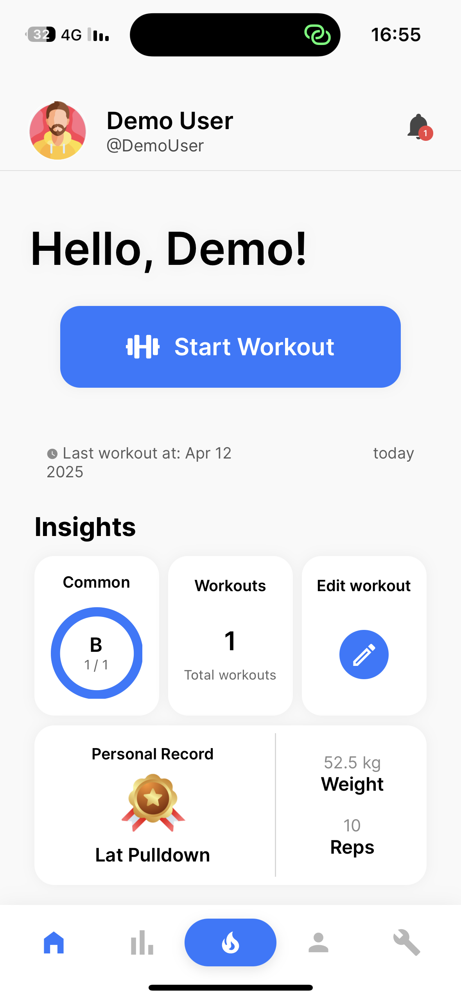
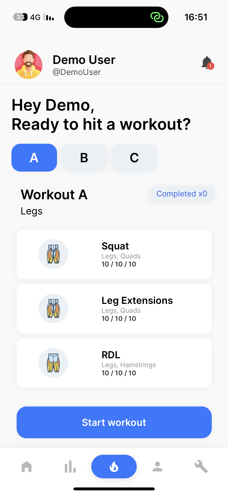
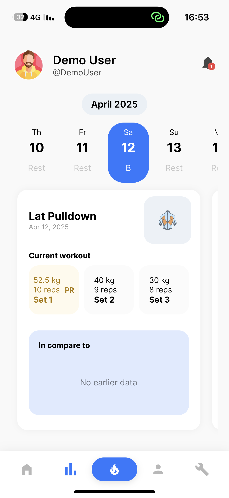
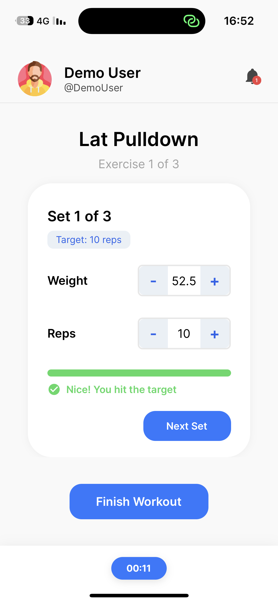
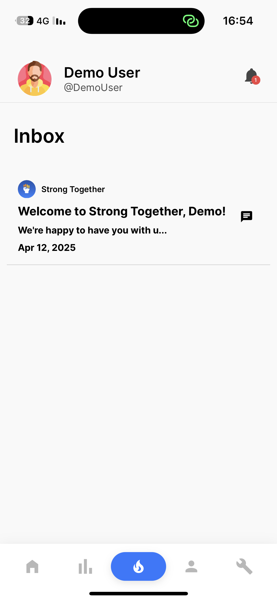
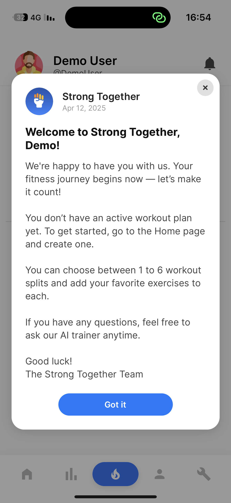

# 🌟 Strong Together 🌟

**Your Ultimate Gym Tracking Companion**

---

<div align="center">

  
  
  
  
  

## </div>

<p align="center">
  
</p>

**Strong-Together-App** is the ultimate fitness companion designed to help users achieve their health and fitness goals. From personalized workout plans to real-time progress tracking, this app makes fitness accessible, engaging, and rewarding.

---

## 🏋️ About Strong-Together-App

The aim of **Strong-Together-App** is to create a seamless fitness platform that combines innovative technology and fitness best practices to:

- **Simplify Workouts**: Provide users with personalized and manageable workout plans.
- **Track Progress**: Monitor user achievements to keep them motivated.
- **Foster Engagement**: Offer in-app tools like notifications and future community options to maintain consistent engagement.
- **Leverage Technology**: Utilize tools like Supabase for real-time data management and React Native for a seamless cross-platform experience.

---

## 🎯 Key Highlights

### 🚀 Core Features

- **Personalized Fitness Plans**: Tailor-made workout plans for every fitness level.
- **Progress Tracking**: Track your exercises, weights, and reps in real time.
- **Push Notifications**: Get reminders and alerts to stay consistent.
- **User-Friendly Interface**: Intuitive and simple design for seamless navigation.

### 💡 Planned Features

- **Community Support**: Create groups, share progress, and participate in challenges.
- **Trainer Mode**: Enable trainers to manage clients with ease.
- **Advanced Analytics**: Gain insights into your fitness journey with detailed reports.

---

## 🛠️ Tech Stack

#### Frontend

- ⚛️ **React Native**: Cross-platform mobile app development.  
  

- 📦 **Expo**: Simplified development and testing.  
  

#### Backend

- 🧱 **Supabase**: Real-time database, authentication, and hosting.
- **PostgreSQL**: Relational database for structured data storage.  
  

---

## 📸 Screenshots

### App Previews

---

<div align="center">
  
  
</div>
<p align="center">
  <strong>Home Screen</strong>: Access fitness summaries and plans.  
  <br>
  <strong>Intro Screen</strong>: Onboarding walkthrough.
</p>

---

<div align="center">
  
</div>
<p align="center">
  <strong>Watch the Program Plan</strong>: View and manage workout plans.
</p>

---

<div align="center">
  
  
</div>
<p align="center">
  <strong>After Workout Statistics</strong>: Summarized session results.  
  <br>
  <strong>Active Workout</strong>: Real-time tracking of sets, reps, and weights.
</p>

---

<div align="center">
  
  
</div>
<p align="center">
  <strong>Inbox</strong>: View and manage messages.  
  <br>
  <strong>Message Modal</strong>: Compose or view messages.
</p>

---

## 🗄️ Database Schema

The database has been divided into three main flows for clarity: **Workout Flow**, **Messages Flow**, and **Tracking Flow**. Each section provides an explanation and visual representation of the database relationships for its respective flow.

---

## 🧠 Edge Functions, Security, and Deno

To ensure sensitive operations are handled securely and efficiently, **Strong-Together** leverages **Supabase Edge Functions**, powered by **Deno**, a modern runtime for JavaScript and TypeScript. This combination enhances both **security**, **scalability**, and **developer productivity**. Additionally, all database tables are protected using **Row Level Security (RLS)**, **Edge Functions**, or **RPC Functions**, ensuring end-to-end security and controlled data access.

---

### 🔐 **Why Use Edge Functions with Deno?**

- **Prevent Data Leaks**: Sensitive logic, like authentication or user profile operations, is moved to the backend, away from the client.
- **Secure by Default**: Deno's secure runtime provides built-in protections, such as strict permissions for file access, network calls, and environment variables.
- **Elevated Privileges**: Supabase Edge Functions use `SUPABASE_SERVICE_ROLE_KEY` to perform privileged operations that regular users cannot.
- **Seamless TypeScript Support**: Deno natively supports TypeScript, making development faster and easier for modern JavaScript developers.
- **Enhanced Table Protection**: Every database table is safeguarded with RLS policies or accessed through controlled Edge or RPC Functions.

---

### 🛠️ **How Deno and Edge Functions Add Value**

| **Feature**                     | **Benefit**                                                                   |
| ------------------------------- | ----------------------------------------------------------------------------- |
| 🔒 **Secure Authentication**    | Handles login, token management, and sensitive data retrieval securely.       |
| 🚀 **Deno-Powered Performance** | Fast and lightweight execution of backend logic with modern tooling.          |
| 🌐 **Expandable Architecture**  | Prepares the app for future integrations like AI-driven workouts or trainers. |
| 🛡️ **Strong Data Protection**   | Combines RLS, Edge Functions, and RPC Functions to enforce strict access.     |

---

### 🧩 **Examples of Edge Function Use Cases**

While exact implementations aren’t disclosed for security reasons, here are some examples of what **Deno-powered Edge Functions** enable:

- **User Management**: Securely manage authentication, registration, and session persistence.
- **Workout Operations**: Handle workout tracking and plan updates without exposing the logic to the client.
- **Sensitive Data Retrieval**: Fetch information (e.g., user statistics, workout history) safely via server-side logic.
- **Controlled Access**: Ensure that all database interactions respect RLS policies or are routed through secure RPC Functions.
- **Advanced Features**: Enable real-time syncing and AI-assisted workflows with server-side logic.

---

### ✅ **Benefits of Backend Delegation**

- **Cleaner Code**: Client-side logic is simpler and safer, focusing only on UI and basic workflows.
- **Stronger Security**: Sensitive operations are isolated on the backend, minimizing attack vectors.
- **Future-Proof**: Adding more advanced features becomes easier without compromising security.

> With the combination of RLS, Edge Functions, and RPC Functions, **Strong-Together** ensures a robust and secure backend that scales with your needs.

> As the project evolves, more edge functions will be added to support new features and improve existing workflows.

---

### 1️⃣ **Workout Flow**

The **Workout Flow** is responsible for managing users, workout plans, workout splits, and exercises. It outlines how workout plans are created, divided into splits, and associated with specific exercises.

<p align="center">
  
</p>

#### Key Tables:

- **Users**:
  - Stores user information such as ID, name, email, and profile image.
- **Workout Plans**:
  - Created by users or trainers and includes attributes like workout level, number of splits, and name.
- **Workout Splits**:
  - Represents divisions of a workout plan, targeting specific muscle groups.
- **Exercises**:
  - Contains information about individual exercises, including target muscles and descriptions.
- **Exercise to Workout Splits**:
  - Links exercises to specific workout splits, specifying the number of sets.

---

### 2️⃣ **Tracking Flow**

The **Tracking Flow** manages the tracking of exercises completed by users during specific workouts. It also handles scheduling workouts with notifications.

<p align="center">
  
</p>

#### Key Tables:

- **Users**:
  - Tracks the progress of each user.
- **Exercise Tracking**:
  - Logs the completion of exercises, including weights, reps, and the date of the workout.
- **Workout Splits**:
  - Connects tracked exercises to the respective workout split.
- **Scheduled Workouts**:
  - Allows users to schedule workout activities with notifications and reminders.

#### Flow Details:

1. Users log their progress for specific exercises in **Exercise Tracking**.
2. **Scheduled Workouts** is used to set up notifications for upcoming workout splits.

---

### 3️⃣ **Messages Flow**

The **Messages Flow** handles the communication between users. It allows users to send and receive messages, with data about senders, receivers, and the content of the messages.

<p align="center">
  
</p>

#### Key Tables:

- **Users**:
  - Acts as both the sender and receiver of messages.
- **Messages**:
  - Stores the content of the message, the subject, and metadata like whether the message has been read.

#### Flow Details:

1. A **sender** (user) initiates a message.
2. The **receiver** (user) gets the message.
3. The `is_read` field tracks whether the message has been opened.

---

## 🖥️ Installation Guide

### ⚡ Quick Start

1. **Clone the Repository**:
   ```bash
   git clone https://github.com/kobihanoch/Strong-Together-App.git
   ```
2. **Navigate to the Project Directory**:
   ```bash
   cd Strong-Together-App
   ```
3. **Install Dependencies**:
   ```bash
   npm install
   ```
4. **Run the Application**:
   ```bash
   npm start
   ```

---

## 🗂️ Folder Structure

Below is the complete folder structure for **Strong-Together-App**, organized and modular. Click the arrow to expand and view all details.

| **Folder**            | **Description**                                                                |
| --------------------- | ------------------------------------------------------------------------------ |
| 📁 **components/**    | Contains reusable UI components used across the app.                           |
| 📁 **context/**       | React Context for managing global state like authentication and notifications. |
| 📁 **hooks/**         | Custom reusable hooks for logic and API calls.                                 |
| 📁 **navigation/**    | Contains navigation stacks for authenticated and unauthenticated users.        |
| 📁 **notifications/** | Handles push notifications and notification logic.                             |
| 📁 **screens/**       | Individual screens for the application.                                        |
| 📁 **services/**      | Backend service logic for interacting with APIs and databases.                 |
| 📁 **utils/**         | Utility functions for common logic and helpers.                                |
| 📁 **src/**           | Core configuration files for the app.                                          |

---

## ⚖️ Copyright Notice

© 2025 Kobi Hanoch. All rights reserved.

This repository and its code are the intellectual property of **Kobi Hanoch**. The following terms apply to this project:

1. **Strict Prohibition**:  
   Unauthorized use, copying, modification, or distribution of any part of this repository is **strictly prohibited**.

2. **Purpose of the Code**:  
   This code is provided **only for observation and learning purposes**. It cannot be used for any commercial or non-commercial purposes without explicit written permission from the author.

3. **Intellectual Property Rights**:  
   All ideas, implementations, and designs in this repository are the intellectual property of the author. Any violations of these rights may lead to legal action.

4. **License**:  
   This project is not open source. Any usage, even partial, must be authorized by **Kobi Hanoch**.

---

## 🙌 Credits

This project was made possible with the help of the following tools, technologies, and resources:

### **Technologies**

- [**React Native**](https://reactnative.dev/)  
   A framework for building cross-platform mobile applications.  
   

- [**Expo**](https://expo.dev/)  
   A powerful toolchain for React Native that simplifies development and testing.  
   

- [**Supabase**](https://supabase.com/)  
   An open-source backend as a service for real-time database management and authentication.

- [**PostgreSQL**](https://www.postgresql.org/)  
   A robust, open-source relational database system.

### **Additional Resources**

- Icons provided by [**Icons8**](https://icons8.com/):  
   React Native, JavaScript, Expo, and other icons.
- Shields.io for generating the badges used in this README.
- Markdown formatting references from [**CommonMark**](https://commonmark.org/).

### **Database Schema Design**

- Database schema designed and visualized using [**dbdiagram.io**](https://dbdiagram.io/).

### Inspiration & Learning

- Tutorials and guides from the [React Native Documentation](https://reactnative.dev/docs/getting-started).
- Community insights and discussions on [Stack Overflow](https://stackoverflow.com/).
- Database schema concepts from [dbdiagram.io](https://dbdiagram.io/).

---

⭐ If you like this project, don’t forget to give it a star! ⭐

For any questions or support, feel free to reach out:

- **GitHub**: [@kobihanoch](https://github.com/kobihanoch)
- **Email**: [kobikobi622@gmail.com](mailto:kobikobi622@gmail.com)
