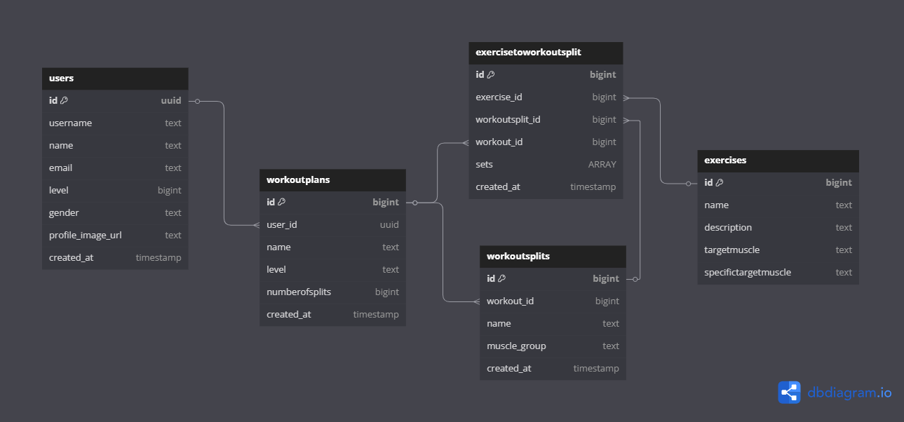
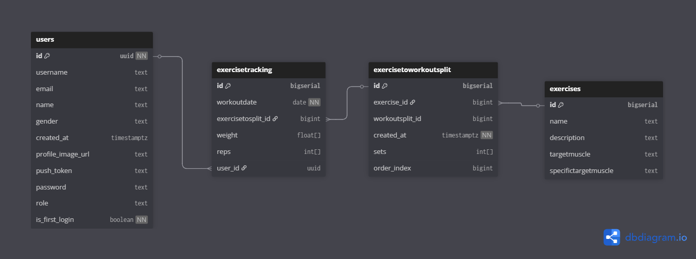
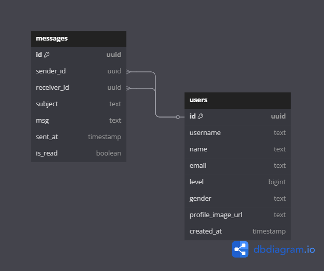

# 🌟 Strong-Together-App 🌟

   

<p align="center">
  
</p>

**Strong-Together-App** is the ultimate fitness companion designed to help users achieve their health and fitness goals. From personalized workout plans to real-time progress tracking, this app makes fitness accessible, engaging, and rewarding.

---

## 🏋️ About Strong-Together-App

The aim of **Strong-Together-App** is to create a seamless fitness platform that combines innovative technology and fitness best practices to:

- **Simplify Workouts**: Provide users with personalized and manageable workout plans.
- **Track Progress**: Monitor user achievements to keep them motivated.
- **Foster Engagement**: Offer in-app tools like notifications and future community options to maintain consistent engagement.
- **Leverage Technology**: Utilize tools like Supabase for real-time data management and React Native for a seamless cross-platform experience.

---

## 🎯 Key Highlights

### 🚀 Core Features

- **Personalized Fitness Plans**: Tailor-made workout plans for every fitness level.
- **Progress Tracking**: Track your exercises, weights, and reps in real time.
- **Push Notifications**: Get reminders and alerts to stay consistent.
- **User-Friendly Interface**: Intuitive and simple design for seamless navigation.

### 💡 Planned Features

- **Community Support**: Create groups, share progress, and participate in challenges.
- **Trainer Mode**: Enable trainers to manage clients with ease.
- **Advanced Analytics**: Gain insights into your fitness journey with detailed reports.

---

## 🛠️ Tech Stack

#### Frontend

- ⚛️ **React Native**: Cross-platform mobile app development.  
  

- 📦 **Expo**: Simplified development and testing.  
  

#### Backend

- 🧱 **Supabase**: Real-time database, authentication, and hosting.
- **PostgreSQL**: Relational database for structured data storage.  
  

---

---

## 🗄️ Database Schema

The database has been divided into three main flows for clarity: **Workout Flow**, **Messages Flow**, and **Tracking Flow**. Each section provides an explanation and visual representation of the database relationships for its respective flow.

---

### 1️⃣ **Workout Flow**

The **Workout Flow** is responsible for managing users, workout plans, workout splits, and exercises. It outlines how workout plans are created, divided into splits, and associated with specific exercises.

<p align="center">
  
</p>

#### Key Tables:

- **Users**:
  - Stores user information such as ID, name, email, and profile image.
- **Workout Plans**:
  - Created by users or trainers and includes attributes like workout level, number of splits, and name.
- **Workout Splits**:
  - Represents divisions of a workout plan, targeting specific muscle groups.
- **Exercises**:
  - Contains information about individual exercises, including target muscles and descriptions.
- **Exercise to Workout Splits**:
  - Links exercises to specific workout splits, specifying the number of sets.

---

### 2️⃣ **Tracking Flow**

The **Tracking Flow** manages the tracking of exercises completed by users during specific workouts. It also handles scheduling workouts with notifications.

<p align="center">
  
</p>

#### Key Tables:

- **Users**:
  - Tracks the progress of each user.
- **Exercise Tracking**:
  - Logs the completion of exercises, including weights, reps, and the date of the workout.
- **Workout Splits**:
  - Connects tracked exercises to the respective workout split.
- **Scheduled Workouts**:
  - Allows users to schedule workout activities with notifications and reminders.

#### Flow Details:

1. Users log their progress for specific exercises in **Exercise Tracking**.
2. **Scheduled Workouts** is used to set up notifications for upcoming workout splits.

---

### 3️⃣ **Messages Flow**

The **Messages Flow** handles the communication between users. It allows users to send and receive messages, with data about senders, receivers, and the content of the messages.

<p align="center">
  
</p>

#### Key Tables:

- **Users**:
  - Acts as both the sender and receiver of messages.
- **Messages**:
  - Stores the content of the message, the subject, and metadata like whether the message has been read.

#### Flow Details:

1. A **sender** (user) initiates a message.
2. The **receiver** (user) gets the message.
3. The `is_read` field tracks whether the message has been opened.

---

## 🖥️ Installation Guide

### ⚡ Quick Start

1. **Clone the Repository**:
   ```bash
   git clone https://github.com/kobihanoch/Strong-Together-App.git
   ```
2. **Navigate to the Project Directory**:
   ```bash
   cd Strong-Together-App
   ```
3. **Install Dependencies**:
   ```bash
   npm install
   ```
4. **Run the Application**:
   ```bash
   npm start
   ```

---

## 🗂️ Folder Structure

Below is the complete folder structure for **Strong-Together-App**, organized and modular. Click the arrow to expand and view all details.

<details>
<summary>📁 Full Folder Structure (Click to Expand)</summary>

| **Folder/File**                       | **Description**                                                                |
| ------------------------------------- | ------------------------------------------------------------------------------ |
| 📁 **components/**                    | Contains reusable UI components used across the app.                           |
| ┣ 📂 **CreateWorkoutComponents/**     | Components specific to creating workout plans.                                 |
| ┣ 📂 **HomeComponents/**              | Components for the home screen.                                                |
| ┣ 📂 **MyWorkoutPlanComponents/**     | Components for managing user workout plans.                                    |
| ┣ 📂 **ProfileComponents/**           | Components for the user profile section.                                       |
| ┣ 📂 **StartWorkoutComponents/**      | Components for initiating and tracking workouts.                               |
| ┣ 📂 **StatisticsComponents/**        | Components for displaying user statistics.                                     |
| ┣ 📄 **BottomTabBar.js**              | A custom bottom tab navigation bar.                                            |
| ┣ 📄 **CountdownComponent.js**        | A countdown timer component for workouts.                                      |
| ┣ 📄 **GradientedGoToButton.js**      | A styled button with gradient effects.                                         |
| ┣ 📄 **InputField.js**                | A reusable input field component.                                              |
| ┣ 📄 **LoadingPage.js**               | A loading screen displayed during data fetches.                                |
| ┣ 📄 **Logo.js**                      | The app’s logo component.                                                      |
| ┣ 📄 **PageIndicator.js**             | Displays pagination or steps in a process.                                     |
| ┣ 📄 **Theme1.js**                    | Defines the theme and styles for the app.                                      |
| ┣ 📄 **ToggleSetting.js**             | A toggle switch component for user settings.                                   |
| ┣ 📄 **TopComponent.js**              | A reusable top header component.                                               |
| ┗ 📄 **Validators.js**                | Utility functions for input validation.                                        |
| 📁 **context/**                       | React Context for managing global state like authentication and notifications. |
| ┣ 📄 **AuthContext.js**               | Handles user authentication state.                                             |
| ┗ 📄 **NotificationsContext.js**      | Manages in-app notifications logic.                                            |
| 📁 **hooks/**                         | Custom reusable hooks for logic and API calls.                                 |
| ┣ 📁 **logic/**                       | Screen-specific logic for managing state and behavior.                         |
| ┣ 📄 **useHomePageLogic.js**          | Logic for the home page.                                                       |
| ┣ 📄 **useProfilePageLogic.js**       | Logic for the profile page.                                                    |
| ┣ 📄 **useStartWorkoutPageLogic.js**  | Logic for the start workout page.                                              |
| ┣ 📄 **useStatisticsPageLogic.js**    | Logic for the statistics page.                                                 |
| ┣ 📄 **useMyWorkoutPlanPageLogic.js** | Logic for managing workout plans.                                              |
| ┣ 📄 **useDeleteWorkout.js**          | Handles workout deletion logic.                                                |
| ┣ 📄 **useExercises.js**              | Fetches and manages exercise-related data.                                     |
| ┣ 📄 **useMediaUploads.js**           | Handles media uploads like images or videos.                                   |
| ┣ 📄 **useSplitExercises.js**         | Splits exercises into manageable sections.                                     |
| ┣ 📄 **useUserData.js**               | Fetches and manages user-related data.                                         |
| ┣ 📄 **useUserWorkout.js**            | Fetches and manages user workout data.                                         |
| ┣ 📄 **useWorkouts.js**               | Custom hook for fetching and managing workout plans.                           |
| ┗ 📄 **useWorkoutSplits.js**          | Manages splits in workout routines.                                            |
| 📁 **navigation/**                    | Contains navigation stacks for authenticated and unauthenticated users.        |
| ┣ 📄 **AppStack.js**                  | Navigation for logged-in users.                                                |
| ┗ 📄 **AuthStack.js**                 | Authentication-related navigation flow.                                        |
| 📁 **notifications/**                 | Handles push notifications and notification logic.                             |
| ┣ 📄 **NotificationsManager.js**      | Handles push notification delivery.                                            |
| ┗ 📄 **NotificationsSetup.js**        | Configuration for notifications.                                               |
| 📁 **screens/**                       | Individual screens for the application.                                        |
| ┣ 📄 **CreateWorkout.js**             | Screen for creating workout plans.                                             |
| ┣ 📄 **Home.js**                      | Main home screen with workout summaries.                                       |
| ┣ 📄 **Intro.js**                     | Introductory screen for first-time users.                                      |
| ┣ 📄 **LogIn.js**                     | Login screen for user authentication.                                          |
| ┣ 📄 **MyWorkoutPlan.js**             | Screen for managing and viewing workout plans.                                 |
| ┣ 📄 **Profile.js**                   | User profile screen.                                                           |
| ┣ 📄 **Register.js**                  | Registration screen for new users.                                             |
| ┣ 📄 **Settings.js**                  | Screen for managing user settings.                                             |
| ┣ 📄 **StartWorkout.js**              | Screen for initiating and tracking workouts.                                   |
| ┗ 📄 **Statistics.js**                | Displays user workout statistics and progress.                                 |
| 📁 **services/**                      | Backend service logic for interacting with APIs and databases.                 |
| ┣ 📄 **AuthService.js**               | Handles user authentication requests to Supabase.                              |
| ┣ 📄 **ExercisesService.js**          | Manages API calls related to exercises.                                        |
| ┣ 📄 **ExerciseTrackingService.js**   | Handles tracking user workout sessions and progress.                           |
| ┣ 📄 **MediaService.js**              | Manages media-related operations like uploads.                                 |
| ┣ 📄 **SplitExerciseService.js**      | Handles splitting exercises into segments.                                     |
| ┣ 📄 **UserService.js**               | Manages user-related API calls.                                                |
| ┣ 📄 **WorkoutService.js**            | Handles workout-related API calls.                                             |
| ┗ 📄 **WorkoutSplitsService.js**      | Manages splits in workout routines.                                            |
| 📁 **utils/**                         | Utility functions for common logic and helpers.                                |
| ┣ 📄 **authUtils.js**                 | Contains helper functions for authentication.                                  |
| ┣ 📄 **homePageUtils.js**             | Utility functions for the home page.                                           |
| ┣ 📄 **myWorkoutPlanUtils.js**        | Functions for managing workout plans.                                          |
| ┣ 📄 **profilePageUtils.js**          | Utility functions for the profile page.                                        |
| ┣ 📄 **realTimeUtils.js**             | Utilities for managing real-time data from Supabase.                           |
| ┣ 📄 **startWorkoutUtils.js**         | Functions for starting workouts.                                               |
| ┗ 📄 **statisticsUtils.js**           | Functions for managing statistics data.                                        |
| 📁 **src/**                           | Core configuration files for the app.                                          |
| ┗ 📄 **supabaseClient.js**            | Supabase client instance for API interactions.                                 |

</details>

---

## 📸 Screenshots

### Home Screen

<p align="center">
  
</p>

### Workout Tracking

<p align="center">
  
</p>

---

## ⚖️ Copyright Notice

© 2025 Kobi Hanoch. All rights reserved.

This repository and its code are the intellectual property of **Kobi Hanoch**. The following terms apply to this project:

1. **Strict Prohibition**:  
   Unauthorized use, copying, modification, or distribution of any part of this repository is **strictly prohibited**.

2. **Purpose of the Code**:  
   This code is provided **only for observation and learning purposes**. It cannot be used for any commercial or non-commercial purposes without explicit written permission from the author.

3. **Intellectual Property Rights**:  
   All ideas, implementations, and designs in this repository are the intellectual property of the author. Any violations of these rights may lead to legal action.

4. **License**:  
   This project is not open source. Any usage, even partial, must be authorized by **Kobi Hanoch**.

---

## 🙌 Credits

This project was made possible with the help of the following tools, technologies, and resources:

### **Technologies**

- [**React Native**](https://reactnative.dev/)  
   A framework for building cross-platform mobile applications.  
   

- [**Expo**](https://expo.dev/)  
   A powerful toolchain for React Native that simplifies development and testing.  
   

- [**Supabase**](https://supabase.com/)  
   An open-source backend as a service for real-time database management and authentication.

- [**PostgreSQL**](https://www.postgresql.org/)  
   A robust, open-source relational database system.

### **Additional Resources**

- Icons provided by [**Icons8**](https://icons8.com/):  
   React Native, JavaScript, Expo, and other icons.
- Shields.io for generating the badges used in this README.
- Markdown formatting references from [**CommonMark**](https://commonmark.org/).

### **Database Schema Design**

- Database schema designed and visualized using [**dbdiagram.io**](https://dbdiagram.io/).

### Inspiration & Learning

- Tutorials and guides from the [React Native Documentation](https://reactnative.dev/docs/getting-started).
- Community insights and discussions on [Stack Overflow](https://stackoverflow.com/).
- Database schema concepts from [dbdiagram.io](https://dbdiagram.io/).

---

⭐ If you like this project, don’t forget to give it a star! ⭐

For any questions or support, feel free to reach out:

- **GitHub**: [@kobihanoch](https://github.com/kobihanoch)
- **Email**: [kobikobi622@gmail.com](mailto:kobikobi622@gmail.com)
