# Strong Together — Mobile Client

Strong Together is a React Native fitness app for planning workouts, running recoverable live sessions, tracking progress, scheduling training, and receiving realtime and AI-assisted analysis results.

Built with **React Native 0.81**, **React 19**, **Expo 54**, and **TypeScript 5.9**.

<p align="center"></p>

<p align="center"><a href="https://apps.apple.com/app/id6745721821"></a></p>

[](https://github.com/kobihanoch/Strong-Together-App/actions)

## Contents

- [Product tour](#product-tour)
- [Architecture in three minutes](#architecture-in-three-minutes)
- [Core technology](#core-technology)
- [Documentation](#documentation)
- [Run locally](#run-locally)
- [Environment](#environment)

## Product tour

### Home and schedule

The dashboard combines the next workout, weekly target, schedule, cardio, and latest progress. It supports light and dark themes.

| Today and weekly overview | Upcoming workout | Cardio and latest progress |
| --- | --- | --- |
| 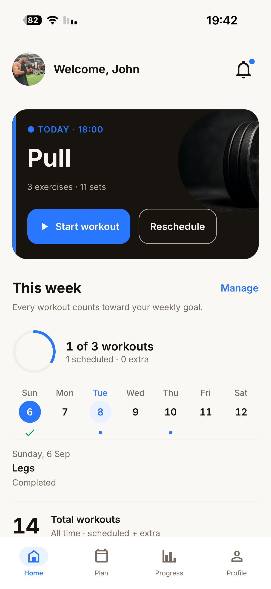 | 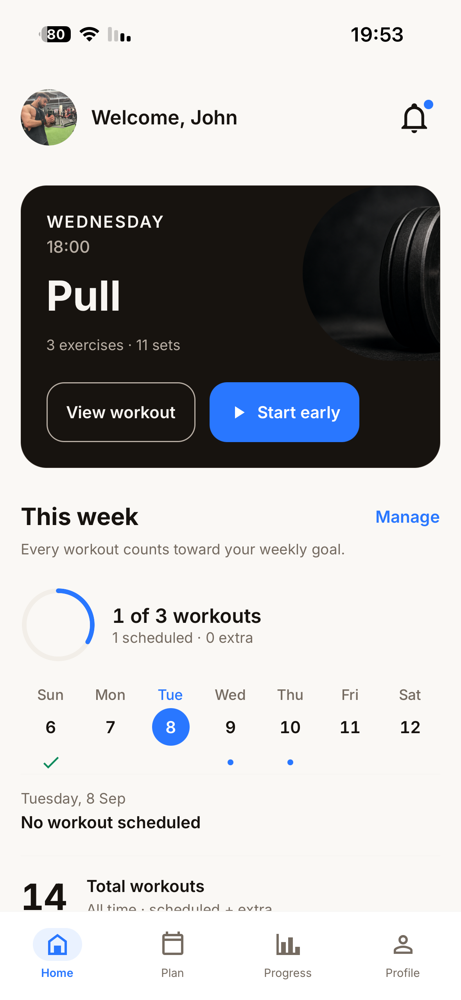 | 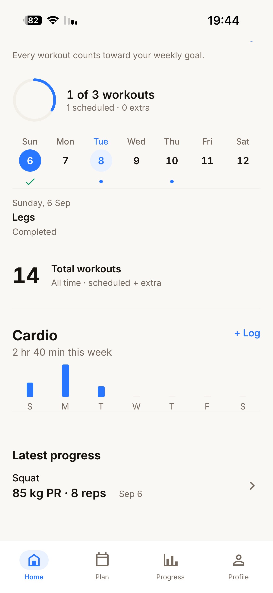 |

| Weekly schedule | Dark mode |
| --- | --- |
| 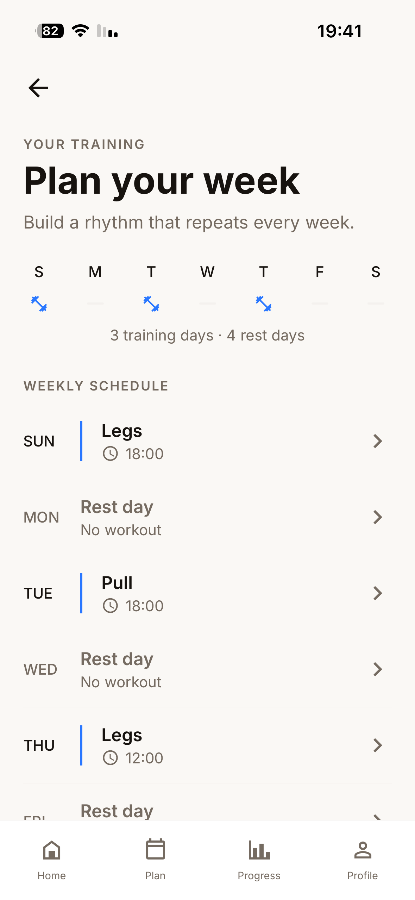 | 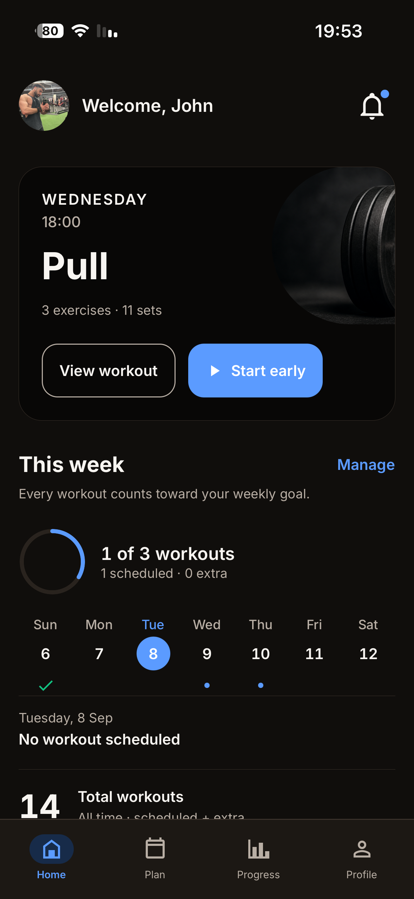 |

### Plan and edit workouts

| Plan overview | Edit sets, reps, and order |
| --- | --- |
| 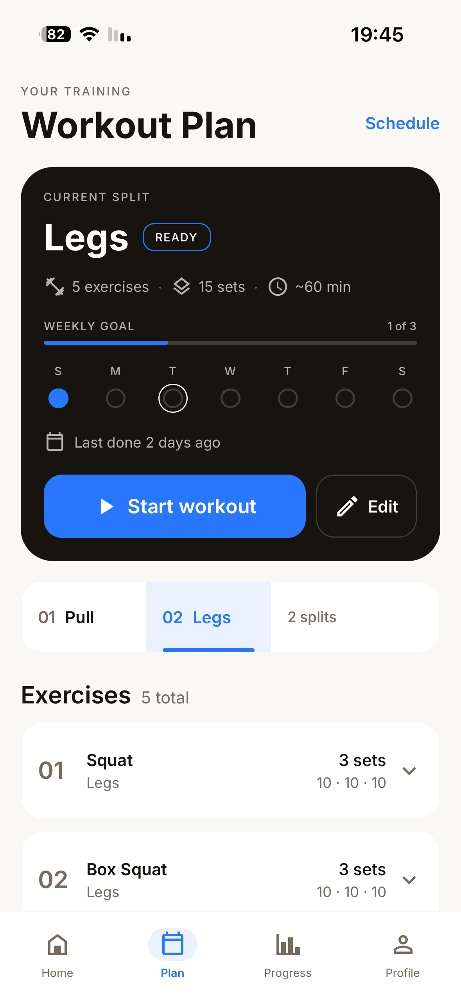 | 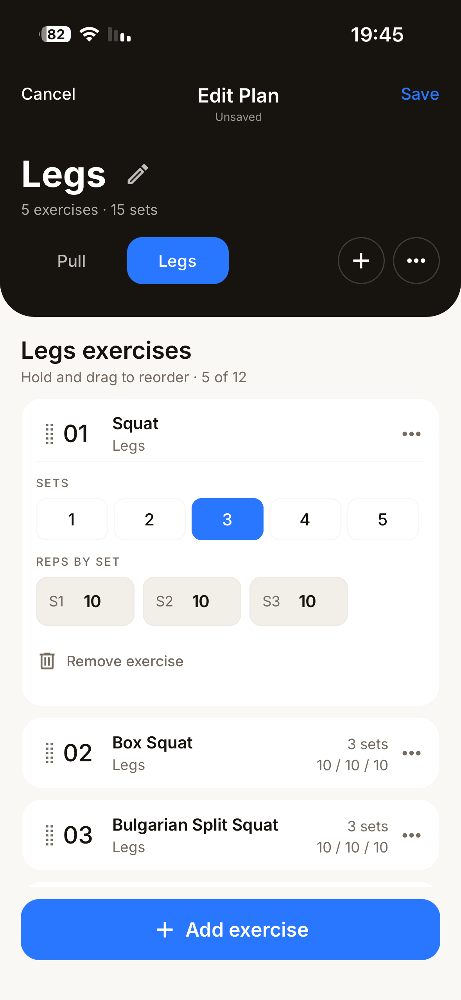 |

### Run a workout

Sessions autosave after every change, survive an app restart, show recent exercise history, support rest timers, and allow exercise reordering.

| Track a set | Rest and strength history | Navigate and reorder |
| --- | --- | --- |
| 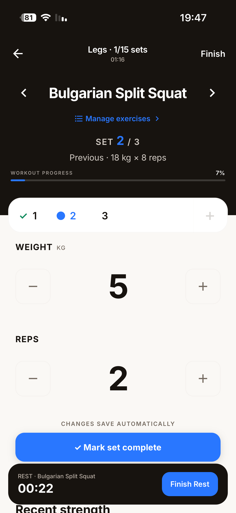 | 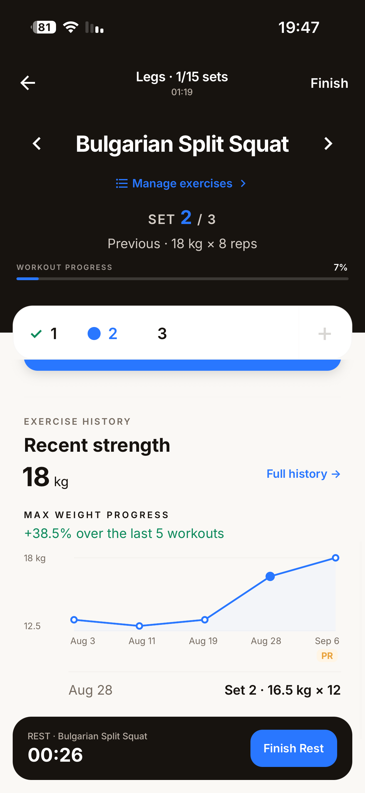 | 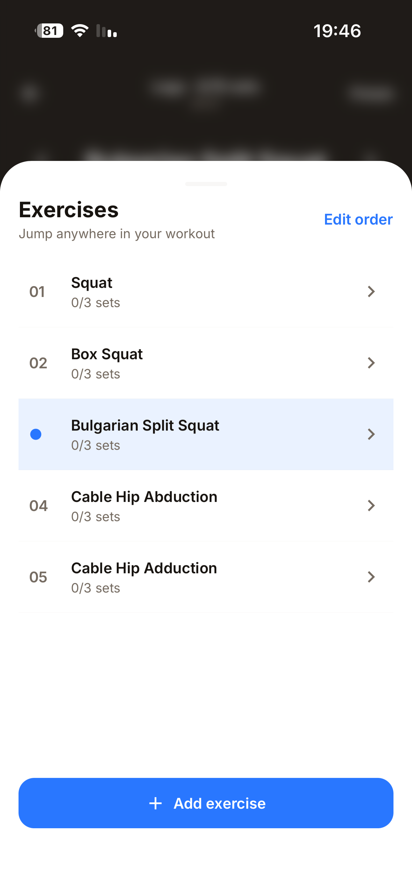 |

| Dark session | Dark rest state |
| --- | --- |
| 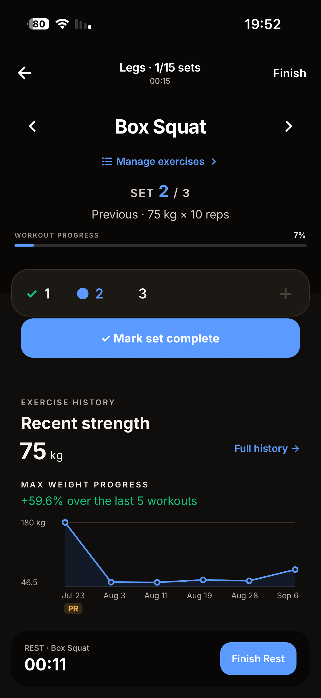 | 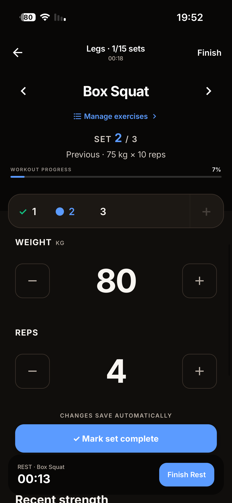 |

### Review progress

| Workout details | Strength and cardio trends |
| --- | --- |
| 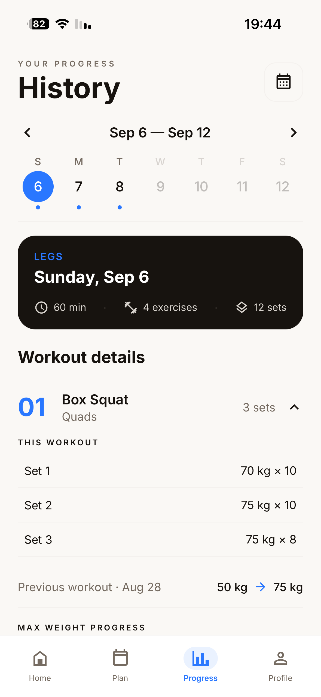 | 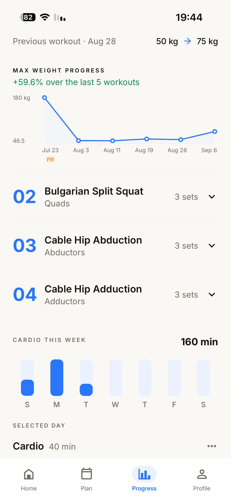 |

## Architecture in three minutes

The v6 refactor follows one rule: **store each kind of state in exactly one place**.

| State | Owner | Examples |
| --- | --- | --- |
| Server state | TanStack Query | Profile, plan, messages, history, cardio, schedules |
| Durable device state | Zustand | Active workout, theme, timezone |
| Session lifecycle | AuthProvider | Auth phase, validation gate, logout |
| Temporary UI state | React | Forms, open sheets, selection, animation |

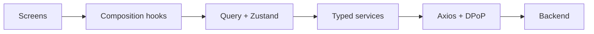
```mermaid
flowchart LR
    UI[Screens] --> Hooks[Composition hooks]
    Hooks --> State[Query + Zustand]
    State --> Services[Typed services]
    Services --> Transport[Axios + DPoP]
    Transport --> API[Backend]
```

Screens mostly render view models and forward events. Composition hooks join feature data for a screen. Feature hooks own queries, mutations, Zustand selectors, and invalidation. Typed services describe endpoints; shared infrastructure applies security, retries, tracing, error handling, persistence, and realtime policy.

Important runtime rules:

- TanStack Query is the only owner of API data and persists an offline-readable, per-user cache in AsyncStorage.
- Zustand persists only device-owned state. The active workout is recoverable and remains available when a save fails.
- SecureStore holds the refresh token, user ID, and DPoP key pair. Access tokens stay in memory.
- Feature queries and the socket start only after cache hydration and server session validation.
- One authenticated effect owns timezone sync, API identity headers, Socket.IO connection, listeners, and cleanup.
- Realtime messages update the existing Query cache; they do not create another state store.

## Core technology

| Technology | Role |
| --- | --- |
| React Native + Expo | Cross-platform app runtime, builds, updates, notifications, and native APIs |
| TypeScript + `@strong-together/shared` | Strict client code and shared API contracts |
| TanStack Query | Server-state fetching, mutation, invalidation, hydration, and persistence |
| Zustand | Small persisted stores for workout recovery, theme, and timezone |
| Axios | One HTTP pipeline with DPoP, token rotation, request IDs, and error classification |
| Socket.IO | Ticketed messages and asynchronous video-analysis results |
| SecureStore + AsyncStorage | Separate secure credentials from recoverable app/cache state |
| Sentry | Error reporting and request/video tracing |
| Skia, Reanimated, Moti, Victory | Charts, motion, and responsive workout UI |

## Documentation

Start with the [documentation map](docs/README.md), then open only the flow you need:

- [Architecture and component boundaries](docs/c4-architecture-overview.md)
- [Frontend ownership and feature map](docs/frontend-architecture.md)
- [Side effects and cleanup](docs/side-effect-lifecycle.md)
- [Startup, authentication, and storage](docs/app-rendering-flow.md)
- [API, realtime, and AI analysis](docs/api-realtime-ai-flow.md)

## Run locally

Requires Node.js 20+, npm, an Expo-compatible environment or device, and backend access.

```bash
git clone https://github.com/kobihanoch/Strong-Together-App.git
cd Strong-Together-App
npm install
npm run start
```

| Command | Purpose |
| --- | --- |
| `npm run ios` / `npm run android` | Start a native platform flow |
| `npm run web` | Start the web target |
| `npm run typecheck` | Check TypeScript |
| `npm run lint` | Run ESLint |
| `npm run test` | Run Jest tests |

## Environment

Create `.env` in the project root. `EXPO_PUBLIC_*` values are bundled into the client; never put private credentials in them.

| Variable | Purpose |
| --- | --- |
| `EXPO_PUBLIC_ENVIRONMENT` | Select development or production behavior |
| `EXPO_PUBLIC_DEV_API` | Development backend URL |
| `EXPO_PUBLIC_API_URL` | Production backend URL |
| `EXPO_PUBLIC_SUPABASE_URL` | Public production media origin |
| `EXPO_PUBLIC_DEV_IMAGE_BUCKET` | Development media origin |
| `EXPO_PUBLIC_SENTRY_DSN` | Production Sentry DSN |
| `APP_PROFILE` | Native development/production build identity |

Backend: [Strong-Together-Backend](https://github.com/kobihanoch/Strong-Together-Backend). Licensed under MIT.
