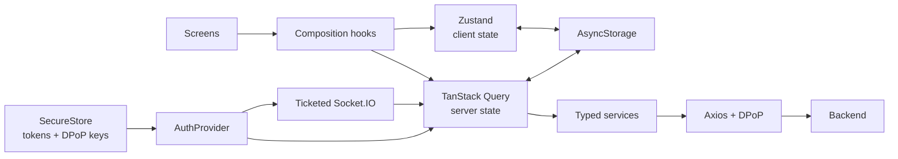

# Strong Together — Mobile Client (v6.0.0)

**React Native 0.81, React 19, Expo 54, TypeScript 5.9, TanStack Query, Zustand, Axios, Socket.IO, OAuth, JWT refresh-token rotation, DPoP proof-of-possession, SecureStore, AsyncStorage, Sentry, Expo Notifications, presigned uploads, and AI-assisted video analysis.** Strong Together is a production mobile fitness client with offline-readable server state, resumable workout sessions, typed API contracts, authenticated realtime events, and a feature-first architecture.

<p align="center"></p>

<p align="center"><a href="https://apps.apple.com/app/id6745721821"></a></p>

[](https://github.com/kobihanoch/Strong-Together-App/actions)

The app covers workout-plan editing, live and resumable sessions, exercise history, personal records, cardio, schedules and reminders, realtime messages, profile management, push notifications, and AI-assisted squat analysis.

## The architecture in one minute


```mermaid
flowchart LR
    UI[Screens] --> H[Composition hooks]
    H --> Q[TanStack Query<br/>server state]
    H --> Z[Zustand<br/>client state]
    Q --> S[Typed services]
    S --> A[Axios + DPoP]
    A --> API[Backend]
    Q <--> AS[AsyncStorage]
    Z <--> AS
    SEC[SecureStore<br/>tokens + DPoP keys] --> AUTH[AuthProvider]
    AUTH --> Q
    AUTH --> WS[Ticketed Socket.IO]
    WS --> Q
```

- `AuthProvider` owns session phases and validation—not domain data.
- TanStack Query owns and persists remote state.
- Zustand owns durable device state: active workout, theme, and timezone.
- SecureStore holds refresh credentials and DPoP keys; access tokens remain in memory.
- One authenticated effect owns the socket lifecycle and writes realtime messages into the Query cache.
- Screens render view models assembled by hooks; services and infrastructure own I/O.

The full rationale, flows, tradeoffs, and comparison with the previous architecture live in the documents below.

## Documentation

| Read this | What it explains |
| --- | --- |
| [Architecture overview](docs/c4-architecture-overview.md) | System context, containers, component boundaries, external systems, and the end-to-end map. |
| [Frontend architecture](docs/frontend-architecture.md) | Feature-first layout, ownership rules, screen-to-hook dependencies, design decisions, and why v6 is better than the old architecture. |
| [App startup and rendering](docs/app-rendering-flow.md) | Boot order, Query and Zustand hydration, navigation gates, session restoration, and provider placement. |
| [Authentication lifecycle](docs/auth-context-flow.md) | Login/OAuth convergence, cached session restore, single-flight rotation, offline behavior, and logout cleanup. |
| [TanStack Query and persistence](docs/server-state-cache-flow.md) | Query keys, per-user isolation, AsyncStorage persistence, cache busting, invalidation, and realtime cache updates. |
| [Zustand and storage ownership](docs/zustand-and-storage.md) | Workout recovery, theme/timezone stores, SecureStore boundaries, migrations, and why remote data is excluded. |
| [API, realtime, and AI](docs/api-realtime-ai-flow.md) | Axios interceptors, socket tickets, message delivery, direct video upload, cancellation, and asynchronous results. |
| [DPoP security](docs/dpop-security-flow.md) | ES256 keys, token binding, signed request proofs, access-token hashing, and threat reduction. |
| [Errors and user feedback](docs/error-alerts.md) | `401`, `426`, offline/server errors, shared notifications, and failure-safe UX. |

## Screenshot placeholders

The old screenshots were removed because they no longer represent v6. Add current captures under `assets/readme/` and replace these placeholders:

| Area | Needed capture |
| --- | --- |
| Authentication | Intro, Login, Register |
| Home | Current dashboard and navigation |
| Workout planning | Plan overview, editor, exercise library, reorder |
| Active workout | Session, rest state, history comparison |
| Progress | Summary, calendar, charts, cardio |
| Account | Schedule/reminders, Inbox, Profile |
| AI analysis | Upload/progress and analysis result |

## Local development

Requires Node.js 20+, npm, an Expo-compatible native environment/device, and backend access.

```bash
git clone https://github.com/kobihanoch/Strong-Together-App.git
cd Strong-Together-App
npm install
npm run start
```

| Command | Purpose |
| --- | --- |
| `npm run ios` / `npm run android` | Start a native platform flow |
| `npm run web` | Start the web target |
| `npm run typecheck` | Run strict TypeScript checks |
| `npm run lint` | Run ESLint |
| `npm run test` | Run Jest integration tests |

## Environment

Create `.env` in the project root. `EXPO_PUBLIC_*` values are embedded in the client and must never contain private server credentials.

| Variable | Purpose |
| --- | --- |
| `EXPO_PUBLIC_ENVIRONMENT` | Select development or production behavior |
| `EXPO_PUBLIC_DEV_API` | Development backend URL |
| `EXPO_PUBLIC_API_URL` | Non-development backend URL |
| `EXPO_PUBLIC_SUPABASE_URL` | Public production media origin |
| `EXPO_PUBLIC_DEV_IMAGE_BUCKET` | Development media origin |
| `EXPO_PUBLIC_SENTRY_DSN` | Production Sentry DSN |
| `APP_PROFILE` | Native development/production build identity |

EAS provides development, preview, and production profiles with separate development and production bundle identifiers.

## Backend and license

Backend: [Strong-Together-Backend](https://github.com/kobihanoch/Strong-Together-Backend). This project is licensed under the MIT License.
