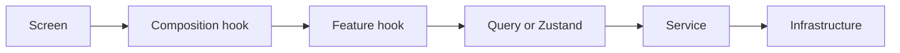

# Documentation map

The main README gives the short architecture tour. These focused guides explain the parts that are easiest to get wrong.

| Guide | Read it when changing |
| --- | --- |
| [Architecture overview](c4-architecture-overview.md) | System boundaries, app layers, or external services |
| [Frontend architecture](frontend-architecture.md) | Screens, composition hooks, feature hooks, or ownership |
| [Side-effect lifecycle](side-effect-lifecycle.md) | Effects, listeners, timers, background work, or cleanup |
| [App startup](app-rendering-flow.md) | Provider order, hydration, navigation gates, or migrations |
| [Authentication](auth-context-flow.md) | Login, restore, refresh rotation, offline auth, or logout |
| [Query cache](server-state-cache-flow.md) | Queries, mutations, invalidation, persistence, or realtime cache updates |
| [Zustand and storage](zustand-and-storage.md) | Workout recovery, theme, timezone, migrations, or storage choice |
| [API, realtime, and AI](api-realtime-ai-flow.md) | Interceptors, sockets, uploads, cancellation, or analysis results |
| [DPoP security](dpop-security-flow.md) | Key creation, proofs, token binding, or security headers |
| [Errors and feedback](error-alerts.md) | Transport errors, user notifications, recovery, or required updates |

## Architecture rule

Dependencies move through a predictable path:

Remote data belongs to Query, durable device state belongs to Zustand, session state belongs to `AuthProvider`, and temporary view state stays in React.
