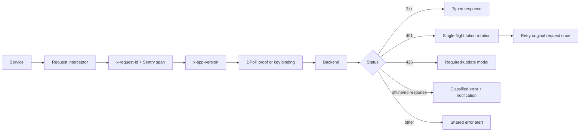
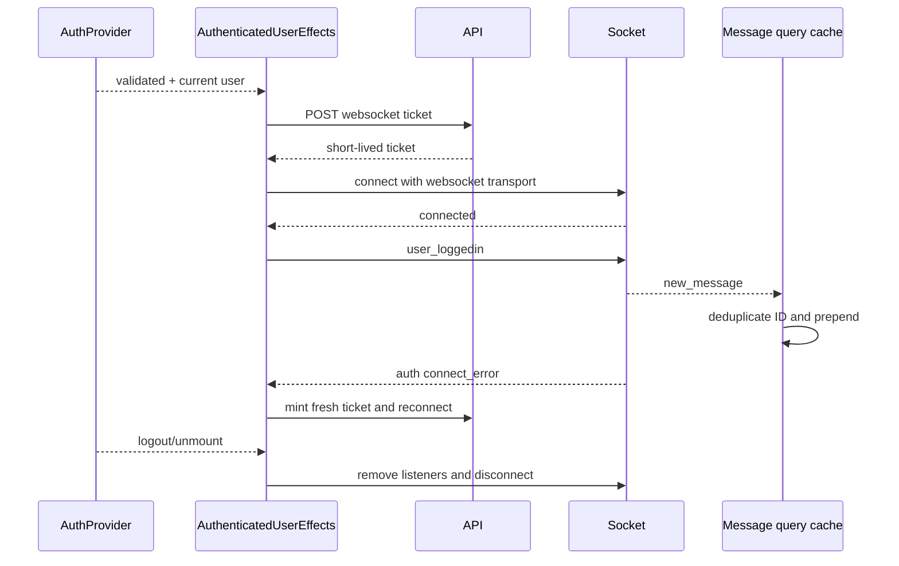
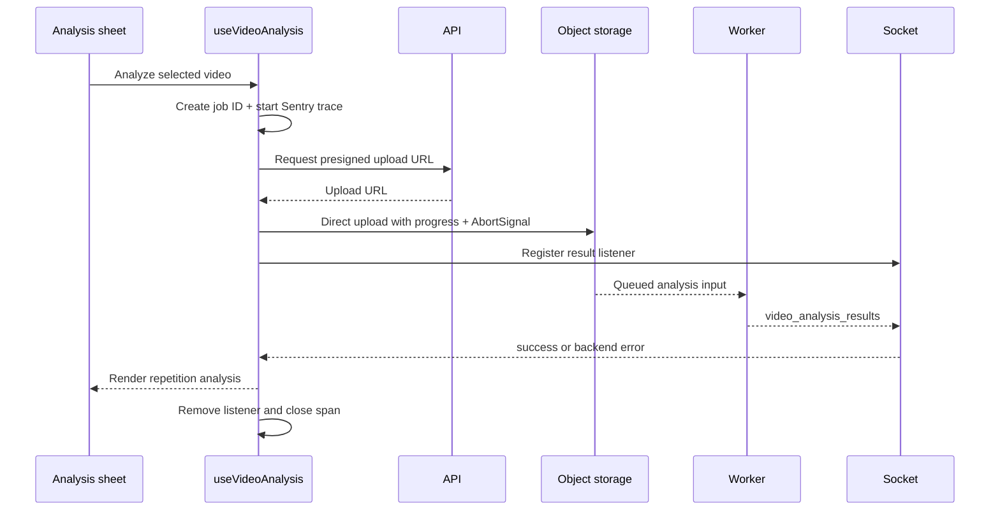

# API, realtime, and AI analysis

## HTTP pipeline

Every feature service uses one Axios instance with a 12-second timeout and shared interceptors.

The request ID survives retries, connecting client diagnostics to backend logs. Sentry HTTP spans finish on success and error. Guest requests attach the DPoP public-key thumbprint; authenticated requests attach signed proofs. The app version lets the backend stop clients whose contracts are no longer compatible.

This policy belongs in infrastructure because no feature should be able to accidentally skip authentication, tracing, upgrade handling, or consistent network semantics.

## Socket ownership

There is one module-level socket and one authenticated owner. `connectionGeneration` increments across connect/disconnect attempts so a ticket returned for an obsolete identity cannot take ownership. A connection is reused only for the same user. Reconnection uses bounded backoff and refreshes the short-lived ticket when the server reports missing, invalid, expired, or unauthorized authentication.

Realtime events update existing state owners. Messages enter the TanStack message cache; video results stay in the active analysis hook because they are transient workflow output.

## AI video pipeline

The UI owns media selection, trim/compression constraints, and supported-exercise checks. The hook owns in-flight exclusion, phases, progress, cancellation, listener cleanup, and observability. A ref mirrors the current phase so asynchronous error handling reports upload and analysis failures accurately.

Direct-to-storage upload keeps large media off the API process and gives the client native progress/cancellation. The backend still authorizes the upload and correlates work through job/request IDs. Socket delivery fits a result whose processing time outlives the initiating HTTP request.

Related files: `infrastructure/api/`, `infrastructure/socket.ts`, `features/messages/`, and `screens/workout-session/hooks/use-video-analysis.hook.ts`.
