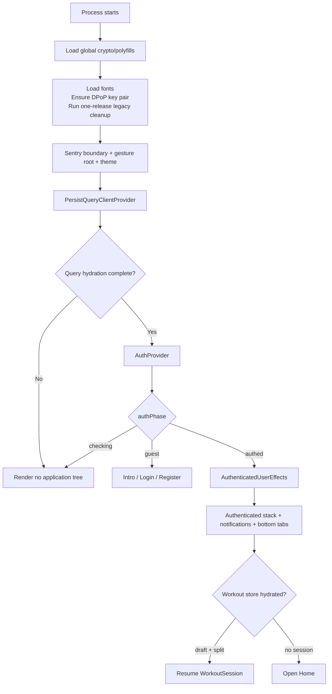

# App startup and rendering

## Boot order



The order is intentional:

1. Crypto support and the DPoP key exist before protected traffic begins.
2. Persisted Query data is restored before feature hooks mount, avoiding false empty states and duplicate startup fetch behavior.
3. Auth checks SecureStore only after the application persistence boundary exists.
4. Cached authenticated UI may mount immediately, but feature queries and sockets wait for `isValidatedWithServer`.
5. `AppStack` waits independently for workout-store hydration so an active workout resumes before choosing its initial route.

## Root provider order

```text
Sentry.ErrorBoundary
  GestureHandlerRootView
    AppThemeProvider
      PersistQueryClientProvider
        QueryHydrationGate
          AuthProvider
            NavigationContainer
              RootNavigator
```

There are no domain-data providers in v6. User, messages, plans, history, cardio, schedules, reminders, and statistics are direct TanStack Query consumers. This keeps the root stable as features grow.

## Authenticated effects

`AuthenticatedUserEffects` is mounted only inside the authenticated branch. It:

- detects and synchronizes timezone changes;
- copies the loaded username into the shared API header;
- obtains a websocket ticket after validation;
- owns socket connection, message-listener registration, and teardown.

Keying the authenticated app with the cached user ID forces clean lifecycle boundaries when identities change. Logout switches to the guest tree, naturally unmounting authenticated effects before local cleanup completes.

## Legacy migration

v6 retains a one-release housekeeping step. It migrates the old `CACHE:USER_ID` into SecureStore, deletes legacy `CACHE:*` and `__VERSION__` keys, then leaves all new remote persistence to TanStack Query. This is compatibility code, not the current cache architecture.
