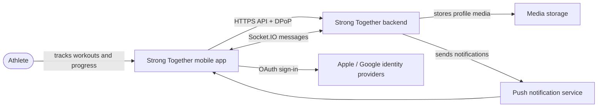
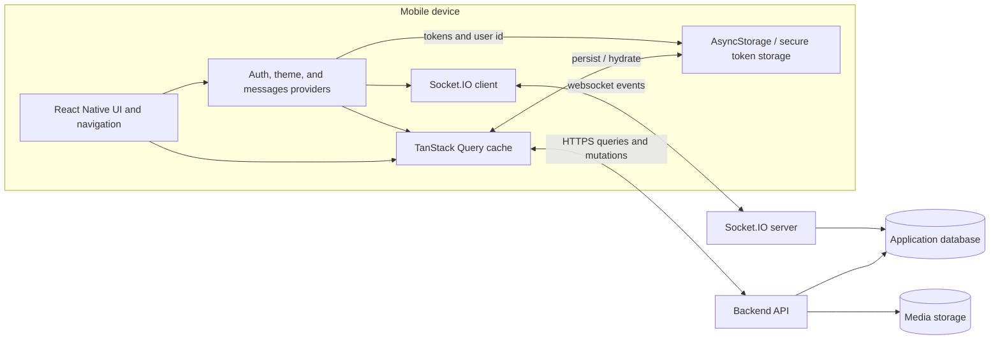
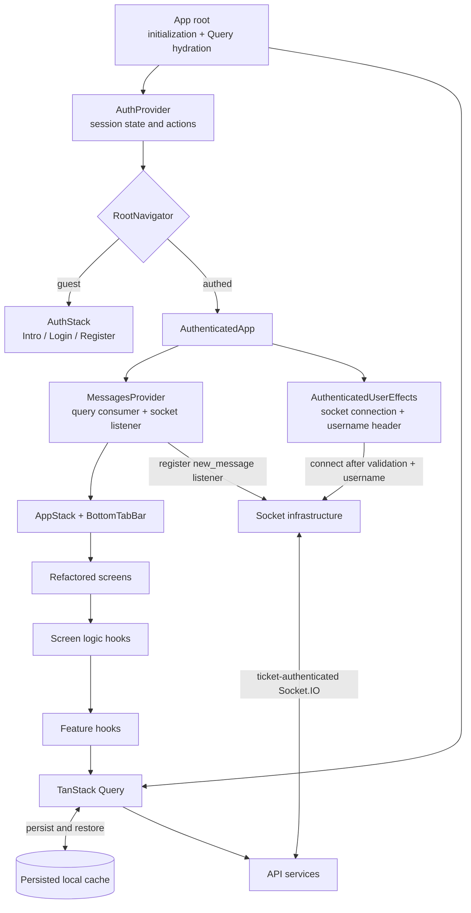
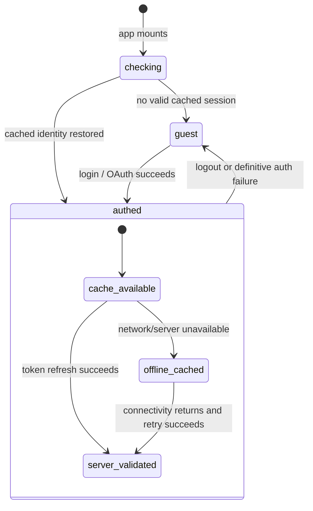
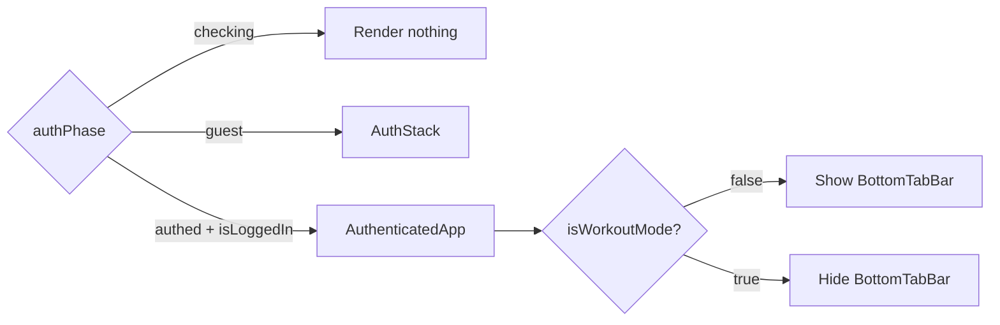
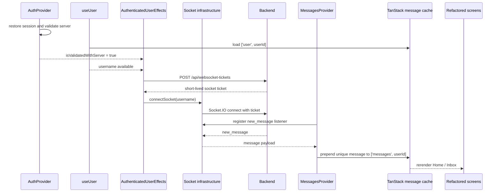
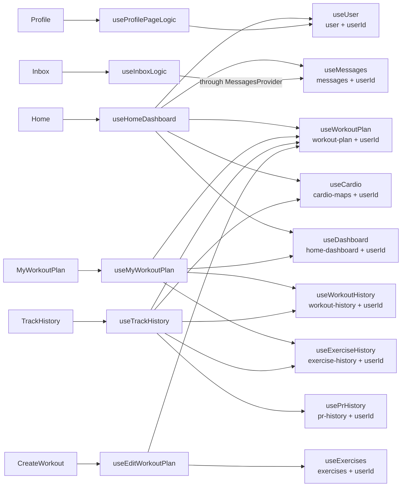
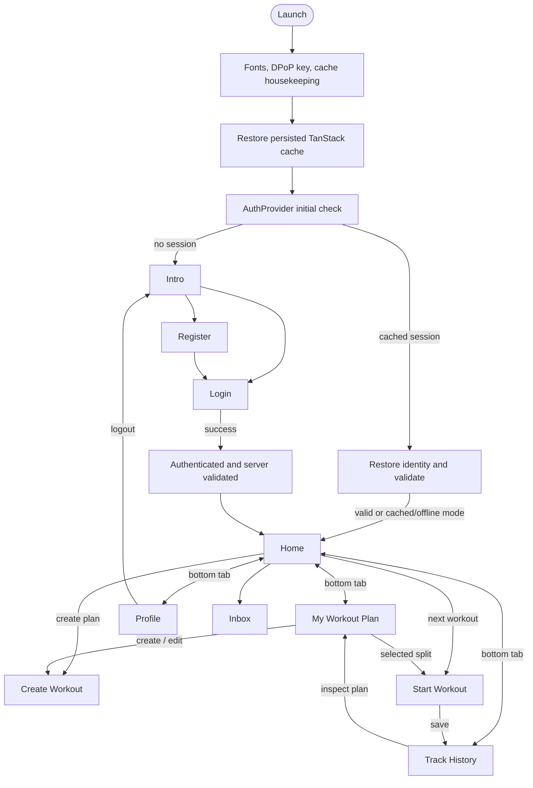

# C4 architecture and application flow

## How to read this document

C4 describes the static structure of the system; it does not replace runtime and navigation diagrams. This overview therefore uses:

1. a **system context** view for people and external systems;
2. a **container** view for the mobile app, API, database, storage, and realtime transport;
3. a **mobile component** view for providers, screens, feature hooks, and infrastructure;
4. separate **sequence/state diagrams** for app startup, auth switching, messages, and navigation.

The component dependency view includes the screens that use the refactored `screen -> screen logic hook -> feature hook` architecture. Other screens remain visible in the navigation flow but should not be presented as if they already use that layering.

## Level 1: System context

## Level 2: Containers

TanStack Query is the owner of remote domain state. `PersistQueryClientProvider` persists that cache to AsyncStorage. Providers coordinate cross-cutting lifecycles; screen logic hooks combine feature data into view-ready state.

## Level 3: Mobile application components

### Provider responsibilities

| Component | Owns | Does not own |
| --- | --- | --- |
| `AuthProvider` | `authPhase`, login state, cached user id, server-validation gate, auth actions, auth loading, workout-mode flag | User profile server data and screen UI |
| `RootNavigator` | Chooses no UI, `AuthStack`, or `AuthenticatedApp` from auth state | Authentication side effects |
| `AuthenticatedUserEffects` | Connects the socket after server validation and username hydration; synchronizes the username API header | Message event handling |
| `MessagesProvider` | Exposes app-wide message state and registers/removes the `new_message` socket listener | Creating the socket connection |
| `PersistQueryClientProvider` | TanStack cache hydration and persistence | Authentication decisions |
| `BottomTabBar` | Main navigation and hiding itself during workout mode / plan editing | Domain state |

## AuthProvider switching and UI toggling

The important switch is `authPhase`; `isLoggedIn` selects the authenticated branch after startup. `isValidatedWithServer` is a separate data-fetch and socket gate, not a navigation state.

`CreateWorkout` also hides the bottom bar based on its route name. This UI toggle is independent of `authPhase`.

## Messages provider and socket flow

On logout, auth cleanup disconnects the socket and clears session/cache state. `MessagesProvider` unmounts with the authenticated branch, so its event listener is removed.

## Refactored screens, feature hooks, and TanStack keys

Every displayed key is a TanStack query key with the form `['key-name', userId]`. The mutations do not currently declare `mutationKey`; successful mutations update their corresponding query cache.

## Complete screen-to-hook matrix

This matrix covers every screen registered in `AuthStack` and `AppStack`. It lists application hooks and provider hooks; framework hooks such as `useState`, `useMemo`, `useNavigation`, and `useWindowDimensions` are intentionally excluded because they do not represent architectural dependencies.

| Screen | Screen or orchestration hook | Auth | User | Messages | Plan | Exercises | Cardio | Dashboard | Workout history | Exercise history | PR history |
| --- | --- | :---: | :---: | :---: | :---: | :---: | :---: | :---: | :---: | :---: | :---: |
| `Intro` | — | ● | | | | | | | | | |
| `Login` | —; child `LoginForm` / `VerifyCard` consume auth | ● | | | | | | | | | |
| `Register` | — | ● | | | | | | | | | |
| `Home` | `useHomeDashboard` | indirect | ● | ● | ● | | ● | ● | | | |
| `MyWorkoutPlan` | `useMyWorkoutPlan` | indirect | | | ● | | | ● | ● | ● | |
| `CreateWorkout` | `useEditWorkoutPlan` | indirect | | | ● | ● | | | | | |
| `TrackHistory` | `useTrackHistory` | indirect | | | ● | | ● | | ● | ● | ● |
| `Profile` | `useProfilePageLogic`; child `useMediaUploads` | ● | ● | | | | | | | | |
| `Inbox` | `useInboxLogic` | indirect | | ● via provider | | | | | | | |
| `Settings` | child `useSettingsLogic` | ● | | | | | | | | | |
| `StartWorkout` | intended: `useStartWorkoutPageLogic`, `useStartWorkoutCache`, `useUserWorkout`, child `useVideoAnalysis` | intended | | | intended | | | | intended | | |
| `Analytics` | intended: `useAnalysticsLogic` | intended | | | intended | | | | intended | | |

Legend:

- **●** means the screen, its screen logic hook, or a screen-owned child directly consumes that application hook.
- **indirect** means the feature hook consumes `useAuth` to obtain `userId` and `isValidatedWithServer`.
- **intended** means the dependency exists only in commented code at present. `StartWorkout` currently renders nothing, and `useAnalysticsLogic` currently returns nothing; these should be visually dashed until their refactors are restored.

### Hook and cache-key legend

| Matrix column | Hook | TanStack query key / state owner |
| --- | --- | --- |
| Auth | `useAuth` / `AuthProvider` | Context state; no TanStack query key |
| User | `useUser` | `['user', userId]` |
| Messages | `useMessages` | `['messages', userId]` |
| Plan | `useWorkoutPlan` | `['workout-plan', userId]` |
| Exercises | `useExercises` | `['exercises', userId]` |
| Cardio | `useCardio` | `['cardio-maps', userId]` |
| Dashboard | `useDashboard` | `['home-dashboard', userId]` |
| Workout history | `useWorkoutHistory` | `['workout-history', userId]` |
| Exercise history | `useExerciseHistory` | `['exercise-history', userId]` |
| PR history | `usePrHistory` | `['pr-history', userId]` |

### Non-query application hooks

| Hook | Owner | Purpose |
| --- | --- | --- |
| `useHomeDashboard` | Home | Composes user, messages, plan, cardio, and dashboard data |
| `useMyWorkoutPlan` | My Workout Plan | Composes plan and history data and owns plan-screen selection state |
| `useTrackHistory` | Track History | Composes workout, exercise, PR, plan, and cardio history |
| `useEditWorkoutPlan` | Create Workout | Owns the plan editor reducer and save flow |
| `useProfilePageLogic` | Profile | Derives profile presentation data and exposes local-user updates |
| `useMediaUploads` | Profile image component | Upload lifecycle; uses a service rather than TanStack Query |
| `useInboxLogic` | Inbox | Adapts message actions and confirmation UI |
| `useSettingsLogic` | Notifications toggle | Reads and changes device notification permission state |
| `useStartWorkoutPageLogic` | Start Workout, currently commented | Intended workout-session orchestration |
| `useStartWorkoutCache` | Start Workout, currently commented | Intended local workout-resume persistence |
| `useUserWorkout` | Start Workout, currently commented/missing | Intended workout-save orchestration |
| `useVideoAnalysis` | Start Workout analysis sheet, currently commented | Intended upload/socket video-analysis pipeline |
| `useAnalysticsLogic` | Analytics, currently commented | Intended analytics presentation/data orchestration |

## Complete application flow

## Diagram maintenance rules

- Show dependencies, not every function call.
- Use component names from the source so readers can search for them.
- Put navigation in the app-flow diagram, not in C4 container arrows.
- Add a screen to the feature map only after it adopts a screen logic hook.
- Put the exact TanStack key beside each feature hook and update it when cache ownership changes.
- Show socket connection ownership and socket listener ownership as two separate relationships.
