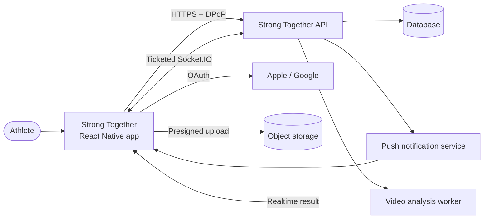
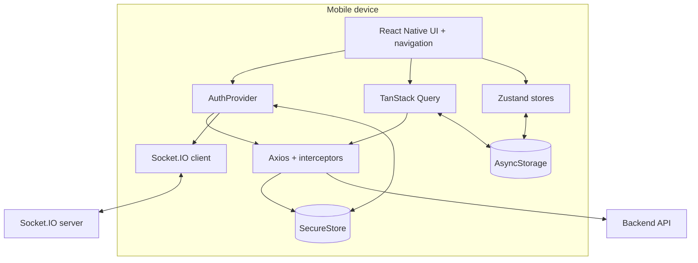
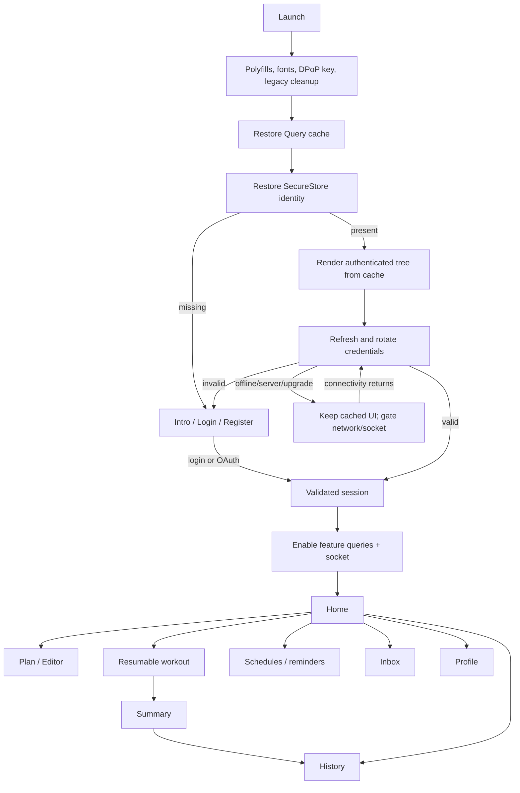

# Architecture overview

## System context

The mobile client never accesses the application database directly. The backend owns authorization, durable domain data, websocket tickets, upload authorization, and job orchestration. Object storage receives large video bytes directly after the API authorizes a short-lived upload.

## Containers inside the device

## Component ownership

| Component                    | Owns                                                             | Does not own                  |
| ---------------------------- | ---------------------------------------------------------------- | ----------------------------- |
| `App`                        | Boot prerequisites and provider order                            | Domain workflows              |
| `AuthProvider`               | Session phases, validation, login completion, logout             | User profile and feature data |
| `PersistQueryClientProvider` | Remote-state hydration/persistence                               | Authentication decisions      |
| `AuthenticatedUserEffects`   | Timezone sync, username header, socket lifecycle/listeners       | UI or navigation              |
| Feature Query hooks          | Remote state, mutations, invalidation, domain helpers            | Credential persistence        |
| Zustand stores               | Durable device-owned state                                       | Server data                   |
| Screen hooks                 | View models and orchestration                                    | Cross-app transport policy    |
| Axios infrastructure         | DPoP, request IDs, version header, refresh, error classification | Presentation state            |

## End-to-end application flow

Related detail: [frontend ownership](frontend-architecture.md), [startup](app-rendering-flow.md), [authentication](auth-context-flow.md), and [API/realtime](api-realtime-ai-flow.md).
