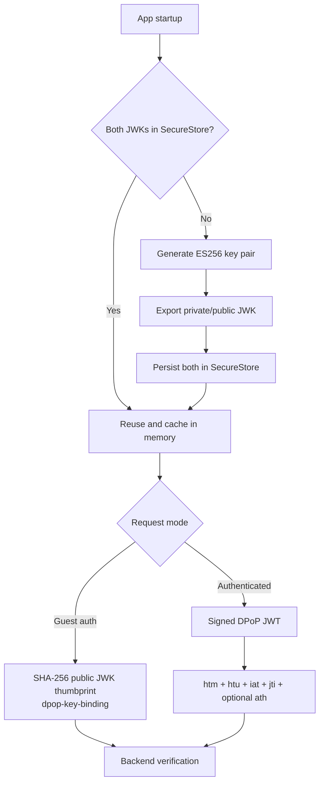

# DPoP proof-of-possession security

DPoP strengthens the JWT flow by requiring both a token and proof that the caller holds the device's private key. It reduces the usefulness of a copied access token; it does not replace TLS, backend authorization, or secure token handling.

## Key lifecycle and request flow

The protected JWT header contains `alg: ES256`, `typ: dpop+jwt`, and the public JWK. Claims contain:

- `jti`: unique proof identifier;
- `htm`: uppercase HTTP method;
- `htu`: absolute origin and path, excluding query noise;
- `iat`: issued-at timestamp;
- `ath`: SHA-256/base64url hash of the access token when present.

For login/OAuth requests, the public JWK thumbprint lets the backend bind issued tokens to this key. Later, the embedded public JWK verifies the signature while `htm`, `htu`, time, unique ID, and `ath` bind the proof to its intended request/token.

## Decisions

- **ES256:** compact asymmetric signatures suit mobile requests and allow verification without sharing the private key.
- **JWK persistence:** serialized keys survive JavaScript runtime restarts more reliably than trying to persist runtime `CryptoKey` objects.
- **SecureStore:** DPoP private material belongs with credentials, not general cache data.
- **Proof per request:** method/URL/token binding narrows replay opportunities.
- **Key creation before app traffic:** features never need to handle a missing-key branch.

DPoP is added centrally by the Axios request interceptor so feature services cannot accidentally implement different proof semantics.

Related files: `infrastructure/api/dpop/`, `infrastructure/api/api-config/helpers/header-injections.ts`, and `App.tsx`.
