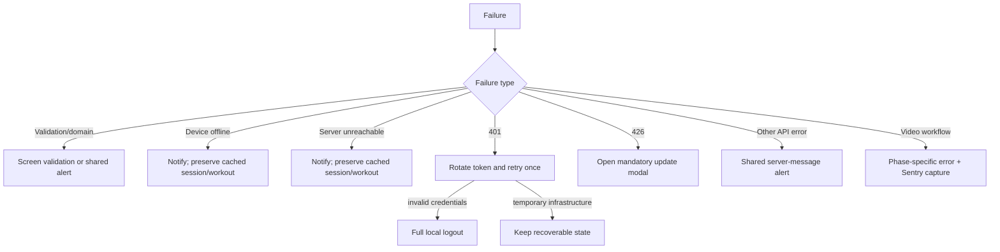

# Errors, recovery, and user feedback

Errors are classified by what the app can safely do next—not merely by status code.

## Transport errors

The Axios interceptor closes the Sentry span before classification:

- `401`: retry once through the shared refresh transaction; emit forced logout only for a definitive auth failure.
- `426`: annotate the Axios error and imperatively open `UpdateAppModal` because compatibility is global, not screen-specific.
- device offline: set `isNetworkError` and notify the user.
- no HTTP response while online: set `isServerError` and report server unavailability.
- other responses: display the backend message when available through `showErrorAlert`.

Error annotations let `AuthProvider` distinguish “credentials rejected” from “validation temporarily impossible.” This prevents an outage from deleting a cached session or unfinished workout.

## UI feedback

`showErrorAlert` and `showSuccessAlert` wrap `react-native-notifier`, creating consistent timing, appearance, and dismissal behavior across auth, plan editing, workout validation, profile actions, and media workflows. Form-level mistakes are rejected close to the control; infrastructure-wide failures are handled centrally.

Video analysis additionally records exceptions in Sentry and chooses copy based on the current phase. Cancellation through `AbortController` is treated as an intentional exit rather than a user-facing failure.

## Failure-safe state

- Failed workout submission keeps the Zustand draft for retry.
- Failed server validation caused by connectivity keeps the Query cache readable.
- Successful logout clears credentials, query persistence, the workout draft, and scheduled reminder.
- Socket and video listeners always expose cleanup functions to prevent duplicate delivery after unmount.

The principle is simple: preserve recoverable user work, remove untrusted credentials, and never hide an incompatibility that requires an app update.

Related files: `infrastructure/api/api-config/helpers/error-handlers.ts`, `shared/alerts/`, `shared/components/UpdateAppModal.tsx`, and `screens/workout-session/hooks/use-video-analysis.hook.ts`.
