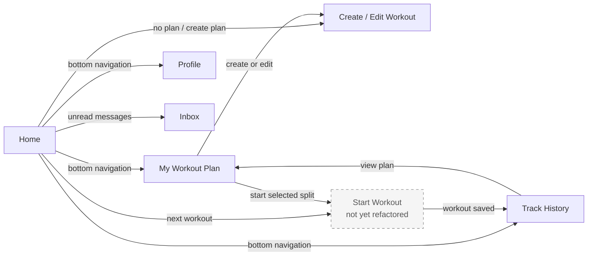
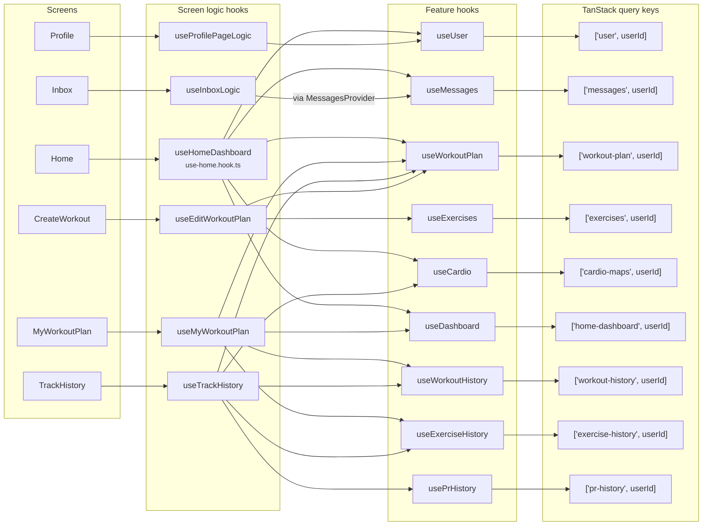

# Refactored frontend architecture

This document maps the screens that currently follow the refactored `screen -> screen logic hook -> feature hook -> TanStack Query` structure. Auth, Intro, Settings, Analytics, and Start Workout are outside this dependency map because they do not yet follow that structure end to end. Start Workout is shown only as a navigation destination.

For the system context, containers, provider lifecycle, socket sequence, and complete application flow, see [C4 architecture and application flow](./c4-architecture-overview.md).

## Main screen flow

The persistent bottom navigation connects `Home`, `MyWorkoutPlan`, `TrackHistory`, and `Profile` in both directions. The arrows above emphasize the main task flow rather than repeating every tab-to-tab combination.

## Screen-to-data dependency map

## Dependency inventory

| Screen | Screen logic hook | Consumed feature hooks and TanStack query keys |
| --- | --- | --- |
| `Home` | `useHomeDashboard` | `useUser` -> `['user', userId]`; `useMessages` -> `['messages', userId]`; `useWorkoutPlan` -> `['workout-plan', userId]`; `useCardio` -> `['cardio-maps', userId]`; `useDashboard` -> `['home-dashboard', userId]` |
| `MyWorkoutPlan` | `useMyWorkoutPlan` | `useWorkoutPlan` -> `['workout-plan', userId]`; `useWorkoutHistory` -> `['workout-history', userId]`; `useExerciseHistory` -> `['exercise-history', userId]`; `useDashboard` -> `['home-dashboard', userId]` |
| `TrackHistory` | `useTrackHistory` | `useWorkoutHistory` -> `['workout-history', userId]`; `useExerciseHistory` -> `['exercise-history', userId]`; `usePrHistory` -> `['pr-history', userId]`; `useWorkoutPlan` -> `['workout-plan', userId]`; `useCardio` -> `['cardio-maps', userId]` |
| `CreateWorkout` | `useEditWorkoutPlan` | `useWorkoutPlan` -> `['workout-plan', userId]`; `useExercises` -> `['exercises', userId]` |
| `Profile` | `useProfilePageLogic` | `useUser` -> `['user', userId]` |
| `Inbox` | `useInboxLogic` | `useMessages` (through `MessagesProvider`) -> `['messages', userId]` |

All keys are query keys. The feature mutations currently do not declare `mutationKey`; on success, they update the associated query cache using the key shown above.

## Layer responsibilities

- **Screen:** renders UI and forwards user events.
- **Screen logic hook:** combines feature data, derives presentation state, owns screen-local state, and exposes screen actions.
- **Feature hook:** owns server operations, TanStack loading state, and cache updates for one domain.
- **TanStack Query cache:** stores authenticated server state, partitioned by `userId`.
