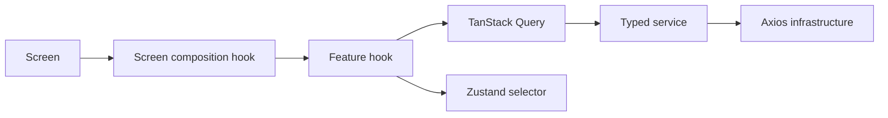

# Frontend architecture

## The rule that organizes v6

State is classified before it is stored:

| Kind of state            | Owner          | Examples                                                     |
| ------------------------ | -------------- | ------------------------------------------------------------ |
| Authentication lifecycle | `AuthProvider` | Auth phase, cached user ID, server-validation gate, logout   |
| Remote/server state      | TanStack Query | User, plan, messages, history, statistics, cardio, schedules |
| Durable client state     | Zustand        | Active workout, theme, detected timezone                     |
| Temporary UI state       | React          | Open sheet, selected row, form input, animation state        |

This avoids duplicated sources of truth. A server response is not copied into Context, and a local workout draft is not forced into a network cache.

## Dependency direction

- **Screens** render and forward user events.
- **Screen hooks** assemble view-ready data, navigation, and local workflow state.
- **Feature hooks** own queries, mutations, derived domain helpers, and invalidation.
- **Services** express endpoints using `@strong-together/shared` contracts.
- **Infrastructure** owns HTTP security, retries, tracing, persistence, and sockets.

Feature hooks return `data`, `loadingStates`, and `actions`. That stable boundary makes screens readable and makes feature behavior testable without embedding transport logic in JSX.

## Feature map

| Screen            | Composition hook           | Primary feature hooks                                              |
| ----------------- | -------------------------- | ------------------------------------------------------------------ |
| Home              | `useHomeScreen`            | User, messages, plan, cardio, dashboard, workout history, schedule |
| My Workout Plan   | `useMyWorkoutPlanScreen`   | Plan, workout history, exercise history, dashboard                 |
| Create Workout    | `useCreateWorkoutScreen`   | Plan and exercise library                                          |
| Workout Session   | `useWorkoutSessionScreen`  | Persisted workout session, exercise history, PRs, exercise library |
| Workout Summary   | `useWorkoutSummaryScreen`  | Persisted session summary and PR history                           |
| Track History     | `useTrackHistoryScreen`    | Workout/exercise/PR history, plan, cardio                          |
| Workout Schedules | `useWorkoutScheduleScreen` | Schedule, reminders, notification permission, plan                 |
| Profile           | `useProfileScreen`         | Current user and profile mutations                                 |
| Inbox             | `useInboxScreen`           | Messages and cache-aware message actions                           |

## Decisions and tradeoffs

- **Feature-first folders:** code that changes together is colocated. The tradeoff is some repeated folder names, but ownership is easier to find than in global `components`, `hooks`, and `services` buckets.
- **Composition hooks instead of smart screens:** route files remain visual. The extra hook layer pays for itself when several domains feed one screen.
- **Shared API contracts:** compile-time drift detection is stronger than handwritten client DTOs. It couples releases to the shared package intentionally.
- **Authoritative refetch after complex mutations:** the server projection wins after a write. This costs a request but avoids fragile manual reconciliation.
- **Derived values remain derived:** progress, next workout, counts, and view models are recomputed rather than persisted as competing truth.
- **Context is narrow:** React Context distributes the auth lifecycle and resolved theme palette; it is not a general state database.
- **Cleanup belongs to the owner:** socket listeners, workout reminders, query data, credentials, and request headers have explicit teardown paths.

## Why this is better than the previous architecture

| Previous approach                               | v6                                                                              | Result                                                                    |
| ----------------------------------------------- | ------------------------------------------------------------------------------- | ------------------------------------------------------------------------- |
| Domain providers copied API state.              | Query cache is the sole remote-state owner.                                     | Fewer providers and synchronization bugs.                                 |
| Custom SWR/bootstrap caching.                   | Persisted TanStack Query with version busting.                                  | Standard freshness, deduplication, invalidation, and hydration semantics. |
| Auth readiness and data readiness were coupled. | Auth validation, Query hydration, and Zustand hydration are separate gates.     | Each startup state has one meaning.                                       |
| Workout state followed screen lifetime.         | Versioned Zustand persistence owns the complete session.                        | Crash/restart recovery and retry-safe saves.                              |
| Refresh could be initiated concurrently.        | One shared refresh transaction plus session generation.                         | Rotation is race-safe and logout cannot be undone by a late request.      |
| Socket responsibility was distributed.          | One authenticated effect owns connect/listen/disconnect.                        | Deterministic realtime lifecycle.                                         |
| Storage roles overlapped.                       | SecureStore, Query persistence, and Zustand persistence have strict boundaries. | Easier security review and migration.                                     |

v6 is simpler where the problem is standard and explicit where the problem is security- or lifecycle-sensitive.
