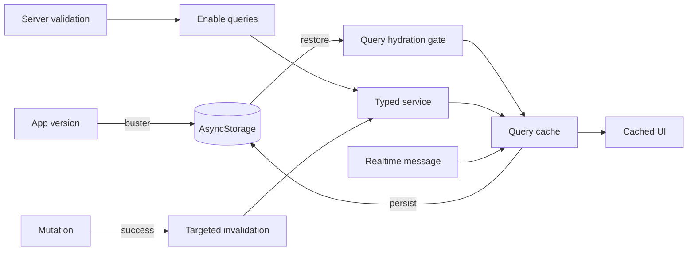

# TanStack Query and server-state persistence

## Ownership

TanStack Query is the only owner of server data. It handles fetching, request deduplication, staleness, loading/error state, invalidation, and persistence for:

- current user and messages;
- workout plans and the exercise library;
- workout schedules and reminder settings;
- dashboard statistics;
- workout, exercise, and personal-record history;
- daily and weekly cardio maps.

## Cache lifecycle

The persister uses AsyncStorage key `REACT_QUERY_OFFLINE_CACHE`. Default queries stay fresh for five minutes and use an infinite garbage-collection window because disk persistence, rather than eviction timing, owns cross-launch availability. The Expo app version is the cache buster: incompatible releases start with a clean query cache.

## Query keys

| Domain | Key |
| --- | --- |
| User | `['user', userId]` |
| Messages | `['messages', userId]` |
| Workout plan | `['workout-plan', userId]` |
| Exercise library | `['exercises', userId]` |
| Schedules | `['workout-schedules', userId]` |
| Reminders | `['reminder', userId]` |
| Dashboard | `['home-dashboard', userId]` |
| Workout history | `['workout-history', userId]` |
| Exercise history | `['exercise-history', userId]` |
| Personal records | `['pr-history', userId]` |
| Cardio | `['cardio-maps', userId]` |

The user ID partitions private data on devices that may authenticate more than one account. Logout additionally cancels active queries, clears memory, and removes the persisted client.

## Mutation policy

Mutations invalidate authoritative projections after success. Examples:

- plan edits invalidate the plan;
- schedule edits invalidate schedules and dashboard statistics;
- cardio writes invalidate cardio maps;
- profile writes invalidate the user;
- a completed workout invalidates workout history, exercise history, PR history, and dashboard statistics.

Complex aggregates are refetched rather than optimistically reconstructed. This costs a round trip but prevents the client from duplicating backend aggregation rules. The active workout is preserved outside Query until submission succeeds, so failed writes remain retryable.

Message read/delete mutations update their existing query cache. `new_message` socket events deduplicate by message ID and prepend into that same cache. HTTP and realtime therefore converge on one state owner.

## Offline behavior

Persisted results can render after hydration even while queries are disabled. Fresh network work begins only after `AuthProvider` confirms the session. If startup validation fails because the device is offline, the server is unavailable, or an upgrade is required, cached data remains visible and private network/socket work remains gated.

This is offline-readable, not an offline write queue. Mutations still require the backend.

## Why Query replaced the custom cache

The old SWR-style implementation duplicated data across AsyncStorage, providers, and custom lifecycle hooks. Query supplies standardized deduplication, stale/fresh semantics, invalidation, hydration, and mutation state. Less custom infrastructure means fewer race conditions and a clearer mental model.

Related files: `infrastructure/query/`, feature `hooks/use-*.hook.ts`, and `infrastructure/cache/cache.constants.ts` for the temporary legacy migration only.

