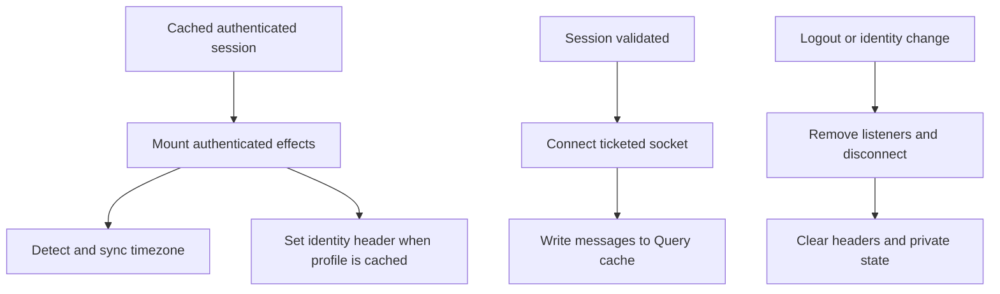
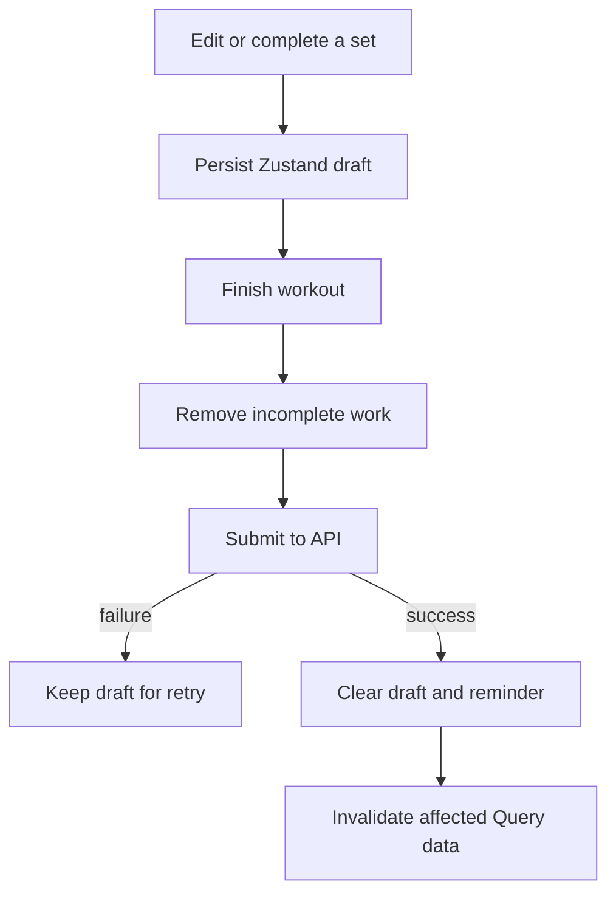
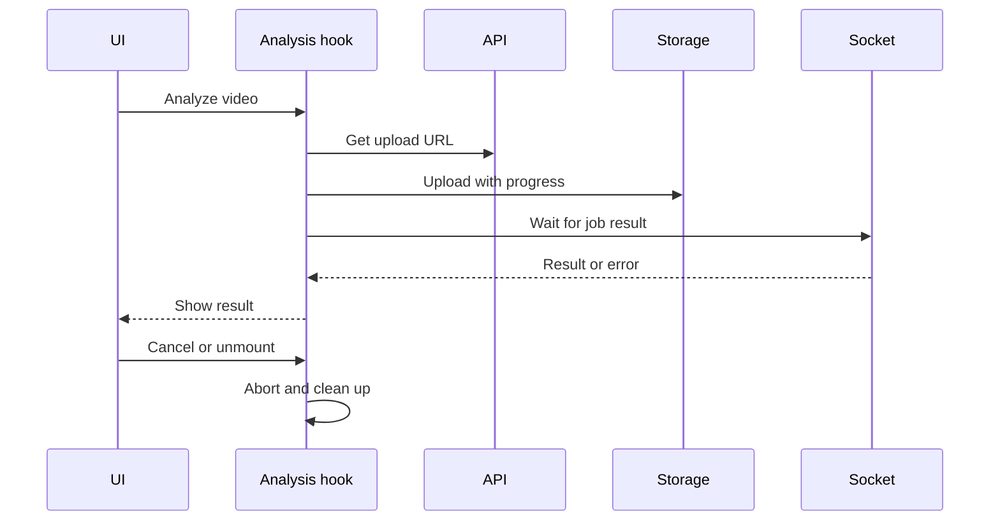

# Side-effect lifecycle

Every side effect has one owner. That owner starts it, prevents duplicate work, and cleans it up.

## Ownership

| Owner | Effects | Cleanup or guard |
| --- | --- | --- |
| `App` | Fonts, DPoP key, legacy cleanup | Finish before protected traffic |
| Query provider | Restore and persist API cache | App-version cache buster |
| `AuthProvider` | Restore, token rotation, validation, logout | Single-flight work and session generation |
| Authenticated effects | Timezone, API identity header, socket listeners | Unmount listeners and disconnect |
| Workout store/hook | Draft autosave, rest reminder, submission | Clear on success/discard; retain on failure |
| Video analysis hook | Upload, progress, result listener, tracing | Abort, remove listener, close trace |

## Authenticated runtime

The module-level socket has one authenticated owner. A connection generation prevents a late ticket for an old identity from taking control.

## Workout completion

The store persists timestamps instead of ticking counters. Elapsed time stays correct through sleep, background suspension, and restart.

## Video analysis

Analysis output is temporary workflow state, so it stays in the hook instead of Query or Zustand.

## Review rule

For each new effect, answer four questions: who owns it, what starts it, what prevents duplicate work, and what cleans it up.
