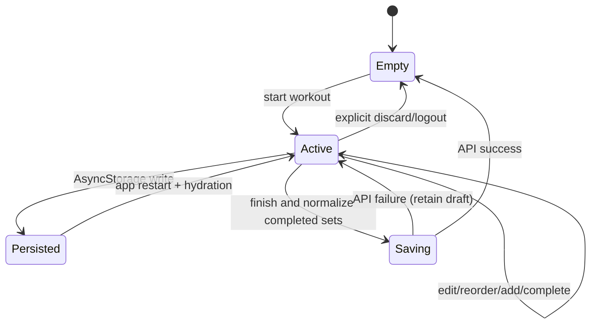

# Zustand and storage ownership

## Why Zustand exists here

TanStack Query answers “what does the server know?” Zustand answers “what durable state does this device currently own?” The distinction keeps a workout draft out of the remote cache and keeps API responses out of a client store.

## Stores

| Store | Persisted state | Behavior |
| --- | --- | --- |
| Workout session | Draft payload, workout split, active exercise/set, completed set keys, rest timestamp | Survives navigation and process restart; resumes directly into `WorkoutSession`. |
| Theme | Active mode | Resolves the palette through `AppThemeProvider` and synchronizes native status-bar styling. |
| Timezone | Last detected IANA zone | Available to React and imperative service/query code; syncs reminder timezone after changes. |

All three use focused selectors so components subscribe only to what they read.

## Workout lifecycle

The store persists start/rest timestamps, not ticking counters. UI derives elapsed time from real timestamps, so sleep, background suspension, and restart do not corrupt duration. Completing work moves a single inactivity reminder; bulk history-fill completion updates once rather than creating artificial rest events.

Before submission, the hook reads the latest store state after adding the end timestamp, removes incomplete work, and requires at least one completed set. Success cancels the reminder, clears storage, and invalidates affected Query data. Failure keeps the draft intact.

## Hydration and migrations

`AppStack` waits for the workout store's `onFinishHydration` signal before choosing its initial route. It resumes only when both a draft and its workout-split context exist.

Workout and timezone stores derive a numeric persistence version from the app version. Their migration policy resets incompatible state instead of attempting unsafe structural guesses. Theme persists only `mode`; timezone persists only `timeZone`; the workout store persists only recoverable session state and not its actions.

## Storage boundary

| Location | Data | Reason |
| --- | --- | --- |
| Memory | Access token, socket instance, refresh lock | Short lifetime and no disk exposure |
| Expo SecureStore | Refresh token, authenticated user ID, private/public DPoP JWKs | Platform-protected identity/security material |
| Query AsyncStorage persister | Versioned API cache | Efficient offline-readable remote data |
| Zustand AsyncStorage persistence | Workout, theme, timezone | Recoverable non-secret client state |
| Utility AsyncStorage keys | Workout reminder ID, temporary v6 migration keys | Narrow imperative lifecycle needs |

SecureStore is not a database and AsyncStorage is not a secret store. Giving each mechanism one role makes logout, migration, and security review straightforward.

Related files: `features/workouts/session/hooks/use-workout-session-store.hook.ts`, `navigation/hooks/use-workout-session-resume.hook.ts`, and `shared/stores/`.
